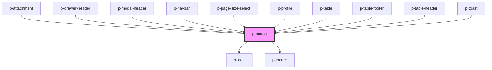

# p-button

<!-- Auto Generated Below -->

## Properties

| Property              | Attribute               | Description                                                                  | Type                                                                                                                                                                                                                                                                                                                                                                                                                                                                                                                                                                                                                                                                                                                                                                                                                                                                                                                                                                                                                                                                                                                                                                                                                                                                                                                                                                | Default     |
| --------------------- | ----------------------- | ---------------------------------------------------------------------------- | ------------------------------------------------------------------------------------------------------------------------------------------------------------------------------------------------------------------------------------------------------------------------------------------------------------------------------------------------------------------------------------------------------------------------------------------------------------------------------------------------------------------------------------------------------------------------------------------------------------------------------------------------------------------------------------------------------------------------------------------------------------------------------------------------------------------------------------------------------------------------------------------------------------------------------------------------------------------------------------------------------------------------------------------------------------------------------------------------------------------------------------------------------------------------------------------------------------------------------------------------------------------------------------------------------------------------------------------------------------------- | ----------- |
| `active`              | `active`                | Wether to force an active state                                              | `boolean`                                                                                                                                                                                                                                                                                                                                                                                                                                                                                                                                                                                                                                                                                                                                                                                                                                                                                                                                                                                                                                                                                                                                                                                                                                                                                                                                                           | `false`     |
| `as`                  | `as`                    | The type of the button                                                       | `"a" \| "button"`                                                                                                                                                                                                                                                                                                                                                                                                                                                                                                                                                                                                                                                                                                                                                                                                                                                                                                                                                                                                                                                                                                                                                                                                                                                                                                                                                   | `'button'`  |
| `buttonGroupPosition` | `button-group-position` | Position of the button in the button group, mostly un-used if not in a group | `"center" \| "end" \| "none" \| "start"`                                                                                                                                                                                                                                                                                                                                                                                                                                                                                                                                                                                                                                                                                                                                                                                                                                                                                                                                                                                                                                                                                                                                                                                                                                                                                                                            | `'none'`    |
| `chevron`             | `chevron`               | Wether to show a chevron or not                                              | `"down" \| "up" \| boolean`                                                                                                                                                                                                                                                                                                                                                                                                                                                                                                                                                                                                                                                                                                                                                                                                                                                                                                                                                                                                                                                                                                                                                                                                                                                                                                                                         | `false`     |
| `chevronPosition`     | `chevron-position`      | Chevron position                                                             | `"end" \| "start"`                                                                                                                                                                                                                                                                                                                                                                                                                                                                                                                                                                                                                                                                                                                                                                                                                                                                                                                                                                                                                                                                                                                                                                                                                                                                                                                                                  | `'end'`     |
| `disabled`            | `disabled`              | Wether the button is disabled                                                | `boolean`                                                                                                                                                                                                                                                                                                                                                                                                                                                                                                                                                                                                                                                                                                                                                                                                                                                                                                                                                                                                                                                                                                                                                                                                                                                                                                                                                           | `false`     |
| `href`                | `href`                  | Href in case of "text" version                                               | `string`                                                                                                                                                                                                                                                                                                                                                                                                                                                                                                                                                                                                                                                                                                                                                                                                                                                                                                                                                                                                                                                                                                                                                                                                                                                                                                                                                            | `undefined` |
| `icon`                | `icon`                  | Icon to show on the button                                                   | `"caret" \| "double-caret" \| "arrow" \| "double-arrow" \| "bell" \| "chat" \| "check-circle" \| "cross-circle" \| "error-circle" \| "info-circle" \| "phone" \| "question-circle" \| "headset" \| "warning" \| "attachment" \| "description" \| "document" \| "folder" \| "pdf" \| "xls" \| "bank" \| "bread" \| "cake" \| "calculator" \| "camera" \| "car" \| "certified" \| "chair" \| "checkmark" \| "city" \| "companies" \| "company" \| "credit-card" \| "cutlery" \| "department" \| "diamond" \| "docter" \| "download" \| "envelope" \| "euro" \| "exam" \| "filter" \| "flower" \| "globe" \| "globe-2" \| "hash" \| "hat" \| "home" \| "integration" \| "language" \| "laptop" \| "location" \| "mail" \| "medal" \| "menu" \| "menu-arrow" \| "minus" \| "more" \| "negative" \| "other" \| "pay" \| "pencil" \| "percent" \| "pie-chart" \| "placeholder" \| "plus" \| "power" \| "receipt" \| "reset" \| "search" \| "send" \| "settings" \| "shuffle" \| "sick" \| "signature" \| "sparkle" \| "star" \| "stroller" \| "tag" \| "tasks" \| "tools" \| "tooth" \| "train" \| "trash" \| "upload" \| "wave" \| "zipcode" \| "eye" \| "eye-closed" \| "key" \| "lock" \| "unlocked" \| "alarm" \| "calendar" \| "calendar-multi" \| "calendar-free" \| "calendar-not-free" \| "clock" \| "female" \| "id" \| "id-two" \| "male" \| "user" \| "users"` | `undefined` |
| `iconFlip`            | `icon-flip`             | Icon flip                                                                    | `"horizontal" \| "none" \| "vertical"`                                                                                                                                                                                                                                                                                                                                                                                                                                                                                                                                                                                                                                                                                                                                                                                                                                                                                                                                                                                                                                                                                                                                                                                                                                                                                                                              | `undefined` |
| `iconOnly`            | `icon-only`             | Wether the button is icon only                                               | `boolean`                                                                                                                                                                                                                                                                                                                                                                                                                                                                                                                                                                                                                                                                                                                                                                                                                                                                                                                                                                                                                                                                                                                                                                                                                                                                                                                                                           | `false`     |
| `iconPosition`        | `icon-position`         | Icon position                                                                | `"end" \| "start"`                                                                                                                                                                                                                                                                                                                                                                                                                                                                                                                                                                                                                                                                                                                                                                                                                                                                                                                                                                                                                                                                                                                                                                                                                                                                                                                                                  | `'end'`     |
| `iconRotate`          | `icon-rotate`           | Icon rotate                                                                  | `-135 \| -180 \| -225 \| -25 \| -270 \| -315 \| -45 \| -90 \| 0 \| 135 \| 180 \| 225 \| 25 \| 270 \| 315 \| 45 \| 90`                                                                                                                                                                                                                                                                                                                                                                                                                                                                                                                                                                                                                                                                                                                                                                                                                                                                                                                                                                                                                                                                                                                                                                                                                                               | `undefined` |
| `inheritText`         | `inherit-text`          | Wether the button should inherit text styles                                 | `boolean`                                                                                                                                                                                                                                                                                                                                                                                                                                                                                                                                                                                                                                                                                                                                                                                                                                                                                                                                                                                                                                                                                                                                                                                                                                                                                                                                                           | `false`     |
| `loading`             | `loading`               | Wether to show a loader or not                                               | `boolean`                                                                                                                                                                                                                                                                                                                                                                                                                                                                                                                                                                                                                                                                                                                                                                                                                                                                                                                                                                                                                                                                                                                                                                                                                                                                                                                                                           | `false`     |
| `size`                | `size`                  | The size of the button                                                       | `"base" \| "lg" \| "sm"`                                                                                                                                                                                                                                                                                                                                                                                                                                                                                                                                                                                                                                                                                                                                                                                                                                                                                                                                                                                                                                                                                                                                                                                                                                                                                                                                            | `'base'`    |
| `target`              | `target`                | Target in case of "text" version                                             | `string`                                                                                                                                                                                                                                                                                                                                                                                                                                                                                                                                                                                                                                                                                                                                                                                                                                                                                                                                                                                                                                                                                                                                                                                                                                                                                                                                                            | `undefined` |
| `type`                | `type`                  | The type of the button                                                       | `"button" \| "submit"`                                                                                                                                                                                                                                                                                                                                                                                                                                                                                                                                                                                                                                                                                                                                                                                                                                                                                                                                                                                                                                                                                                                                                                                                                                                                                                                                              | `'button'`  |
| `underline`           | `underline`             | Wether the text variant has underline                                        | `boolean`                                                                                                                                                                                                                                                                                                                                                                                                                                                                                                                                                                                                                                                                                                                                                                                                                                                                                                                                                                                                                                                                                                                                                                                                                                                                                                                                                           | `true`      |
| `variant`             | `variant`               | The variant of the button                                                    | `"dropdown" \| "primary" \| "secondary" \| "text" \| "transparent"`                                                                                                                                                                                                                                                                                                                                                                                                                                                                                                                                                                                                                                                                                                                                                                                                                                                                                                                                                                                                                                                                                                                                                                                                                                                                                                 | `'primary'` |

## Events

| Event     | Description        | Type                      |
| --------- | ------------------ | ------------------------- |
| `onClick` | Button click event | `CustomEvent<MouseEvent>` |

## Dependencies

### Used by

 - [p-attachment](../attachment)
 - [p-drawer-header](../../atoms/drawer-header)
 - [p-modal-header](../../atoms/modal-header)
 - [p-navbar](../../organisms/navbar)
 - [p-page-size-select](../page-size-select)
 - [p-profile](../profile)
 - [p-table](../../organisms/table)
 - [p-table-footer](../table-footer)
 - [p-table-header](../table-header)
 - [p-toast](../toast)

### Depends on

- [p-icon](../../atoms/icon)
- [p-loader](../../atoms/loader)

### Graph

----------------------------------------------

*Built with [StencilJS](https://stenciljs.com/)*
