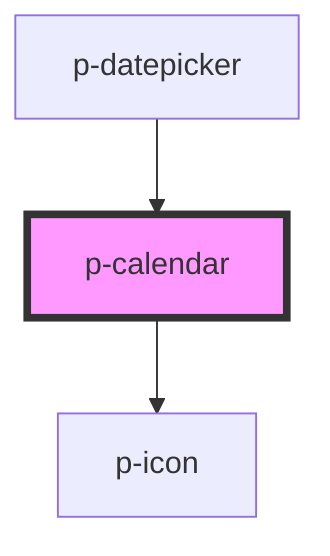

# Calendar

## Usage:

```html
<p-calendar />
```

<!-- Auto Generated Below -->


## Properties

| Property          | Attribute          | Description                             | Type                             | Default                   |
| ----------------- | ------------------ | --------------------------------------- | -------------------------------- | ------------------------- |
| `disableWeekends` | `disable-weekends` | Wether to disable the weekends          | `boolean`                        | `false`                   |
| `disabledDates`   | `disabled-dates`   | Disabled dates                          | `("string" \| Date)[] \| string` | `undefined`               |
| `maxDate`         | `max-date`         | Max date                                | `"string" \| Date`               | `this._getAutomaticMax()` |
| `minDate`         | `min-date`         | Min date                                | `"string" \| Date`               | `new Date(1970, 0, 1)`    |
| `mode`            | `mode`             | The mode of the datepicker              | `"day" \| "month" \| "year"`     | `'day'`                   |
| `preselectToday`  | `preselect-today`  | Wether to automatically preselect today | `boolean`                        | `false`                   |
| `value`           | `value`            | The current value                       | `"string" \| Date`               | `undefined`               |
| `variant`         | `variant`          | The variant of the button               | `"default" \| "embedded"`        | `'default'`               |


## Events

| Event         | Description                  | Type               |
| ------------- | ---------------------------- | ------------------ |
| `valueChange` | Event when the value changes | `CustomEvent<any>` |


## Dependencies

### Used by

 - [p-datepicker](../datepicker)

### Depends on

- [p-icon](../../atoms/icon)

### Graph


----------------------------------------------

*Built with [StencilJS](https://stenciljs.com/)*
