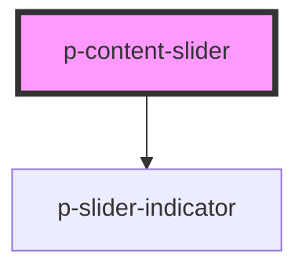

# Slider Indicator

## Usage:

```html
<p-content-slider>
    <!-- Items -->
</p-content-slider>
```

<!-- Auto Generated Below -->


## Properties

| Property                | Attribute                 | Description                                              | Type      | Default |
| ----------------------- | ------------------------- | -------------------------------------------------------- | --------- | ------- |
| `disableDrag`           | `disable-drag`            | Wether to disable dragging the content                   | `boolean` | `false` |
| `disableIndicatorClick` | `disable-indicator-click` | Wether to disable clicking the indicator scrolls content | `boolean` | `false` |
| `hideMobileIndicator`   | `hide-mobile-indicator`   | Wether to hide the indicator on mobile                   | `boolean` | `false` |


## Dependencies

### Depends on

- [p-slider-indicator](../../atoms/slider-indicator)

### Graph


----------------------------------------------

*Built with [StencilJS](https://stenciljs.com/)*
