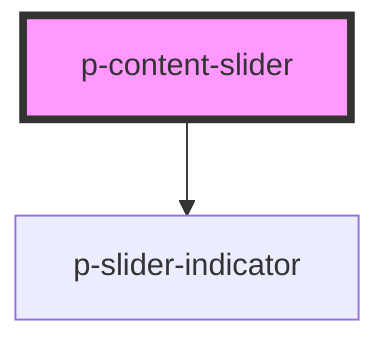

# Slider Indicator

## Usage:

```html
<p-content-slider>
    <!-- Items -->
</p-content-slider>
```

<!-- Auto Generated Below -->

## Properties

| Property              | Attribute               | Description                            | Type      | Default |
| --------------------- | ----------------------- | -------------------------------------- | --------- | ------- |
| `hideMobileIndicator` | `hide-mobile-indicator` | Wether to hide the indicator on mobile | `boolean` | `false` |

## Dependencies

### Depends on

-   [p-slider-indicator](../../atoms/slider-indicator)

### Graph



---

_Built with [StencilJS](https://stenciljs.com/)_
