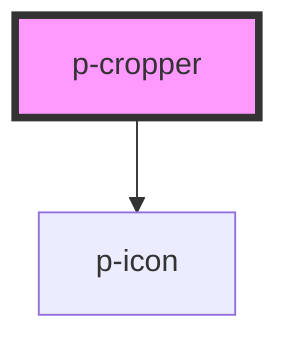

# Cropper

## Usage

```html
<p-cropper onChange={ev => console.log(ev)} />
```

<!-- Auto Generated Below -->


## Properties

| Property     | Attribute     | Description                               | Type                   | Default     |
| ------------ | ------------- | ----------------------------------------- | ---------------------- | ----------- |
| `returnType` | `return-type` | The return type of the onchange           | `"base64" \| "canvas"` | `'base64'`  |
| `value`      | `value`       | The image to crop (url or base64)         | `any`                  | `undefined` |
| `variant`    | `variant`     | Variant of the image that's being cropped | `"company" \| "user"`  | `'user'`    |


## Events

| Event         | Description                  | Type               |
| ------------- | ---------------------------- | ------------------ |
| `valueChange` | Event when the value changes | `CustomEvent<any>` |


## Dependencies

### Depends on

- [p-icon](../../atoms/icon)

### Graph


----------------------------------------------

*Built with [StencilJS](https://stenciljs.com/)*
