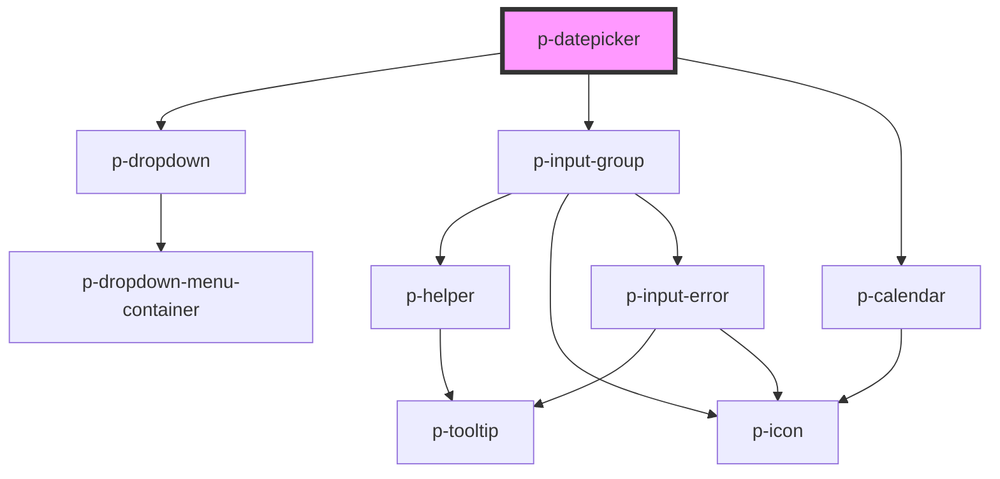

# Select

## Usage:

```html
<p-datepicker>
    <!-- content -->
</p-datepicker>
```

<!-- Auto Generated Below -->


## Properties

| Property          | Attribute          | Description                                               | Type                             | Default        |
| ----------------- | ------------------ | --------------------------------------------------------- | -------------------------------- | -------------- |
| `disableWeekends` | `disable-weekends` | Wether to disable the weekends                            | `boolean`                        | `false`        |
| `disabled`        | `disabled`         | Wether the input group is disabled used by the datepicker | `boolean`                        | `false`        |
| `disabledDates`   | `disabled-dates`   | Disabled dates                                            | `("string" \| Date)[] \| string` | `undefined`    |
| `error`           | `error`            | The helper of the input group used by the datepicker      | `string`                         | `undefined`    |
| `format`          | `format`           | The display & parse format to use                         | `string`                         | `'dd-MM-yyyy'` |
| `helper`          | `helper`           | The helper of the input group used by the datepicker      | `string`                         | `undefined`    |
| `label`           | `label`            | The label of the input group used by the datepicker       | `string`                         | `undefined`    |
| `maxDate`         | `max-date`         | Max date                                                  | `"string" \| Date`               | `undefined`    |
| `minDate`         | `min-date`         | Min date                                                  | `"string" \| Date`               | `undefined`    |
| `mode`            | `mode`             | The mode of the datepicker                                | `"day" \| "month" \| "year"`     | `'day'`        |
| `placeholder`     | `placeholder`      | The placeholder of the input                              | `string`                         | `undefined`    |
| `prefix`          | `prefix`           | The prefix of the input group used by the datepicker      | `string`                         | `undefined`    |
| `preselectToday`  | `preselect-today`  | Wethter to automatically preselect today                  | `boolean`                        | `false`        |
| `size`            | `size`             | The size of the input group used by the datepicker        | `"medium" \| "small"`            | `'medium'`     |
| `value`           | --                 | The current value                                         | `Date`                           | `undefined`    |


## Events

| Event         | Description                  | Type               |
| ------------- | ---------------------------- | ------------------ |
| `valueChange` | Event when the value changes | `CustomEvent<any>` |


## Dependencies

### Depends on

- [p-dropdown](../dropdown)
- [p-input-group](../input-group)
- [p-calendar](../calendar)

### Graph


----------------------------------------------

*Built with [StencilJS](https://stenciljs.com/)*
