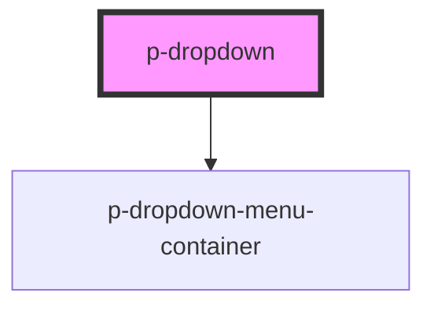

# Dropdown

## Usage:

```html
<p-dropdown>
    <p-button variant="secondary" slot="trigger">Click me</p-button>
    <div slot="items">
        <p-dropdown-menu-item>Item 1</p-dropdown-menu-item>
        <p-dropdown-menu-item>Item 2</p-dropdown-menu-item>
        <p-dropdown-menu-item>Item 3</p-dropdown-menu-item>
    </div>
</p-dropdown>
```

<!-- Auto Generated Below -->


## Properties

| Property              | Attribute               | Description                                                           | Type                | Default    |
| --------------------- | ----------------------- | --------------------------------------------------------------------- | ------------------- | ---------- |
| `disableTriggerClick` | `disable-trigger-click` | Wether to automatically close the dropdown menu after clicking inside | `boolean`           | `false`    |
| `insideClick`         | `inside-click`          | Wether to automatically close the dropdown menu after clicking inside | `boolean`           | `false`    |
| `placement`           | `placement`             | The content of the dropdown menu                                      | `"bottom" \| "top"` | `'bottom'` |
| `show`                | `show`                  | Wether to show the dropdown menu                                      | `boolean`           | `false`    |


## Events

| Event    | Description       | Type                   |
| -------- | ----------------- | ---------------------- |
| `isOpen` | Open change event | `CustomEvent<boolean>` |


## Dependencies

### Depends on

- [p-dropdown-menu-container](../../atoms/dropdown-menu-container)

### Graph


----------------------------------------------

*Built with [StencilJS](https://stenciljs.com/)*
