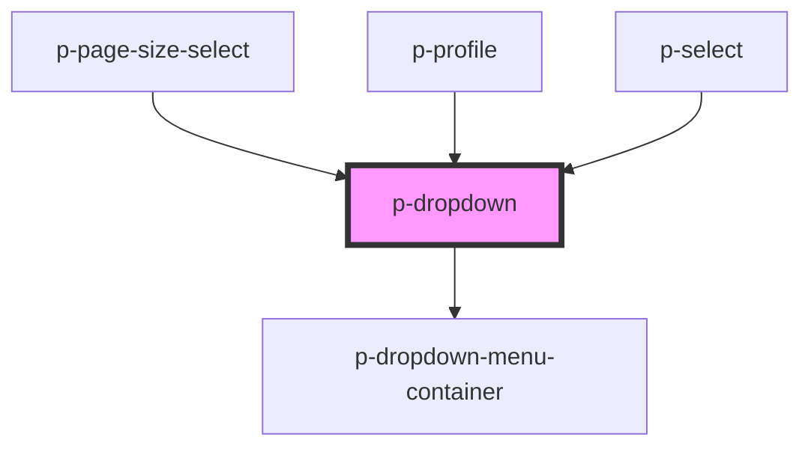

# Dropdown

## Usage:

```html
<p-dropdown>
    <p-button variant="secondary" slot="trigger">Click me</p-button>
    <div slot="items">
        <p-dropdown-menu-item>Item 1</p-dropdown-menu-item>
        <p-dropdown-menu-item>Item 2</p-dropdown-menu-item>
        <p-dropdown-menu-item>Item 3</p-dropdown-menu-item>
    </div>
</p-dropdown>
```

<!-- Auto Generated Below -->


## Properties

| Property              | Attribute               | Description                                                                  | Type                                                                                                                                                                                                         | Default          |
| --------------------- | ----------------------- | ---------------------------------------------------------------------------- | ------------------------------------------------------------------------------------------------------------------------------------------------------------------------------------------------------------ | ---------------- |
| `calculateWidth`      | `calculate-width`       | Wether to automatically calculate the width of the menu based on the trigger | `boolean`                                                                                                                                                                                                    | `false`          |
| `chevronDirection`    | `chevron-direction`     | Chevron direction                                                            | `"down" \| "up"`                                                                                                                                                                                             | `undefined`      |
| `chevronPosition`     | `chevron-position`      | Chevron position                                                             | `"end" \| "start"`                                                                                                                                                                                           | `'end'`          |
| `disableTriggerClick` | `disable-trigger-click` | Wether to automatically close the dropdown menu after clicking inside        | `boolean`                                                                                                                                                                                                    | `false`          |
| `insideClick`         | `inside-click`          | Wether to automatically close the dropdown menu after clicking inside        | `boolean`                                                                                                                                                                                                    | `false`          |
| `placement`           | `placement`             | The content of the dropdown menu                                             | `"auto" \| "auto-end" \| "auto-start" \| "bottom" \| "bottom-end" \| "bottom-start" \| "left" \| "left-end" \| "left-start" \| "right" \| "right-end" \| "right-start" \| "top" \| "top-end" \| "top-start"` | `'bottom-start'` |
| `show`                | `show`                  | Wether to show the dropdown menu                                             | `boolean`                                                                                                                                                                                                    | `false`          |
| `strategy`            | `strategy`              | The strategy of the popover placement                                        | `"absolute" \| "fixed"`                                                                                                                                                                                      | `'fixed'`        |


## Events

| Event    | Description       | Type                   |
| -------- | ----------------- | ---------------------- |
| `isOpen` | Open change event | `CustomEvent<boolean>` |


## Dependencies

### Used by

 - [p-page-size-select](../page-size-select)
 - [p-profile](../profile)
 - [p-select](../select)

### Depends on

- [p-dropdown-menu-container](../../atoms/dropdown-menu-container)

### Graph


----------------------------------------------

*Built with [StencilJS](https://stenciljs.com/)*
