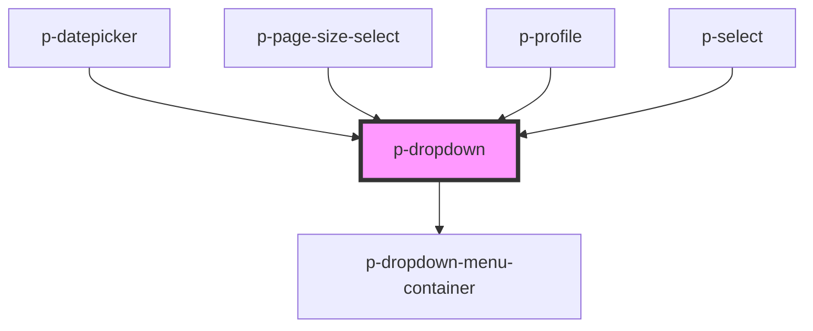

# p-dropdown

<!-- Auto Generated Below -->

## Properties

| Property              | Attribute               | Description                                                                   | Type                                                                                                                                                                 | Default          |
| --------------------- | ----------------------- | ----------------------------------------------------------------------------- | -------------------------------------------------------------------------------------------------------------------------------------------------------------------- | ---------------- |
| `applyFullWidth`      | `apply-full-width`      | Wether to apply the full width                                                | `boolean`                                                                                                                                                            | `true`           |
| `applyMaxWidth`       | `apply-max-width`       | Wether to apply the max width                                                 | `boolean`                                                                                                                                                            | `true`           |
| `calculateWidth`      | `calculate-width`       | Wether to automatically calculate the width of the menu based on the trigger  | `boolean`                                                                                                                                                            | `false`          |
| `chevronDirection`    | `chevron-direction`     | Chevron direction                                                             | `"down" \| "up"`                                                                                                                                                     | `undefined`      |
| `chevronPosition`     | `chevron-position`      | Chevron position                                                              | `"end" \| "start"`                                                                                                                                                   | `'end'`          |
| `disableTriggerClick` | `disable-trigger-click` | Wether to automatically close the dropdown menu after clicking inside         | `boolean`                                                                                                                                                            | `false`          |
| `insideClick`         | `inside-click`          | Wether to automatically close the dropdown menu after clicking inside         | `boolean`                                                                                                                                                            | `false`          |
| `placement`           | `placement`             | The content of the dropdown menu                                              | `"bottom" \| "bottom-end" \| "bottom-start" \| "left" \| "left-end" \| "left-start" \| "right" \| "right-end" \| "right-start" \| "top" \| "top-end" \| "top-start"` | `'bottom-start'` |
| `scrollable`          | `scrollable`            | Wether the dropdown container should be scrollable when the threshold is met. | `boolean`                                                                                                                                                            | `false`          |
| `show`                | `show`                  | Wether to show the dropdown menu                                              | `boolean`                                                                                                                                                            | `false`          |
| `strategy`            | `strategy`              | The strategy of the popover placement                                         | `"absolute" \| "fixed"`                                                                                                                                              | `'absolute'`     |

## Events

| Event    | Description       | Type                   |
| -------- | ----------------- | ---------------------- |
| `isOpen` | Open change event | `CustomEvent<boolean>` |

## Dependencies

### Used by

 - [p-datepicker](../datepicker)
 - [p-page-size-select](../page-size-select)
 - [p-profile](../profile)
 - [p-select](../select)

### Depends on

- [p-dropdown-menu-container](../../atoms/dropdown-menu-container)

### Graph

----------------------------------------------

*Built with [StencilJS](https://stenciljs.com/)*
