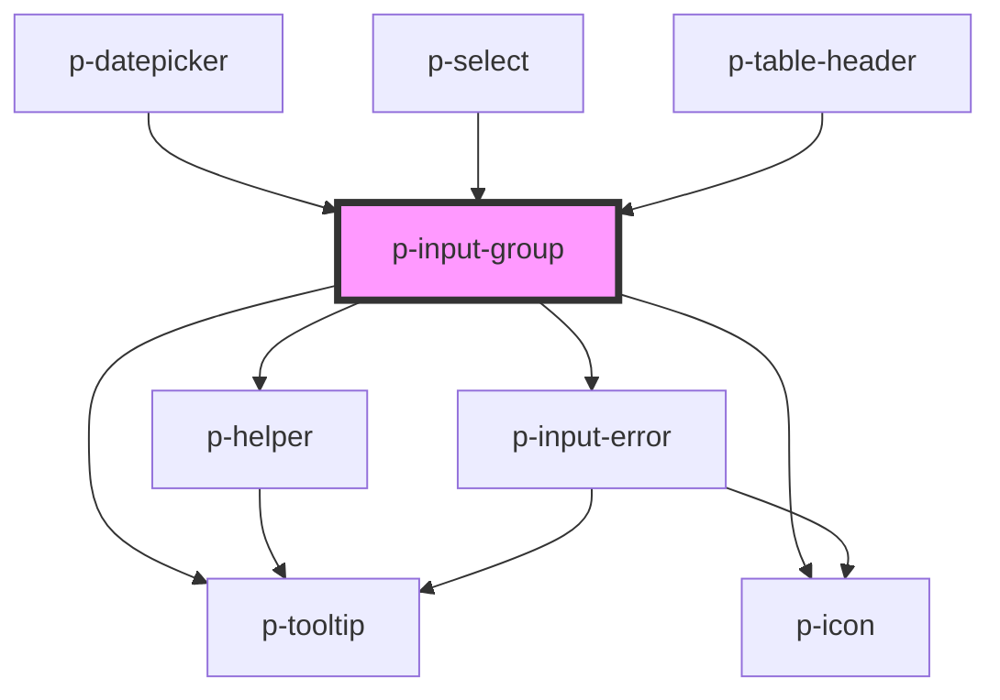

# p-input-group

<!-- Auto Generated Below -->

## Properties

| Property           | Attribute            | Description                               | Type                                                                                                                                                                                                                                                                                                                                                                                                                                                                                                                                                                                                                                                                                                                                                                                                                                                                                                                                                                                                                                                                                                                                                                                                                                                                                                                                                                | Default     |
| ------------------ | -------------------- | ----------------------------------------- | ------------------------------------------------------------------------------------------------------------------------------------------------------------------------------------------------------------------------------------------------------------------------------------------------------------------------------------------------------------------------------------------------------------------------------------------------------------------------------------------------------------------------------------------------------------------------------------------------------------------------------------------------------------------------------------------------------------------------------------------------------------------------------------------------------------------------------------------------------------------------------------------------------------------------------------------------------------------------------------------------------------------------------------------------------------------------------------------------------------------------------------------------------------------------------------------------------------------------------------------------------------------------------------------------------------------------------------------------------------------- | ----------- |
| `disabled`         | `disabled`           | Wether the input group is disabled        | `boolean`                                                                                                                                                                                                                                                                                                                                                                                                                                                                                                                                                                                                                                                                                                                                                                                                                                                                                                                                                                                                                                                                                                                                                                                                                                                                                                                                                           | `false`     |
| `error`            | `error`              | The helper of the input group             | `string`                                                                                                                                                                                                                                                                                                                                                                                                                                                                                                                                                                                                                                                                                                                                                                                                                                                                                                                                                                                                                                                                                                                                                                                                                                                                                                                                                            | `undefined` |
| `errorVariant`     | `error-variant`      | The error variant to use                  | `"auto" \| "element" \| "suffix"`                                                                                                                                                                                                                                                                                                                                                                                                                                                                                                                                                                                                                                                                                                                                                                                                                                                                                                                                                                                                                                                                                                                                                                                                                                                                                                                                   | `'auto'`    |
| `focusMethod`      | `focus-method`       | The method to use when focusing the input | `"click" \| "focus"`                                                                                                                                                                                                                                                                                                                                                                                                                                                                                                                                                                                                                                                                                                                                                                                                                                                                                                                                                                                                                                                                                                                                                                                                                                                                                                                                                | `'focus'`   |
| `focused`          | `focused`            | Wether the input group is focused         | `boolean`                                                                                                                                                                                                                                                                                                                                                                                                                                                                                                                                                                                                                                                                                                                                                                                                                                                                                                                                                                                                                                                                                                                                                                                                                                                                                                                                                           | `false`     |
| `forceShowTooltip` | `force-show-tooltip` | Force show the error tooltip              | `boolean`                                                                                                                                                                                                                                                                                                                                                                                                                                                                                                                                                                                                                                                                                                                                                                                                                                                                                                                                                                                                                                                                                                                                                                                                                                                                                                                                                           | `false`     |
| `helper`           | `helper`             | The helper of the input group             | `string`                                                                                                                                                                                                                                                                                                                                                                                                                                                                                                                                                                                                                                                                                                                                                                                                                                                                                                                                                                                                                                                                                                                                                                                                                                                                                                                                                            | `undefined` |
| `icon`             | `icon`               | Icon of the input group                   | `"caret" \| "double-caret" \| "arrow" \| "double-arrow" \| "bell" \| "chat" \| "check-circle" \| "cross-circle" \| "error-circle" \| "info-circle" \| "phone" \| "question-circle" \| "headset" \| "warning" \| "attachment" \| "description" \| "document" \| "folder" \| "pdf" \| "xls" \| "bank" \| "bread" \| "cake" \| "calculator" \| "camera" \| "car" \| "certified" \| "chair" \| "checkmark" \| "city" \| "companies" \| "company" \| "credit-card" \| "cutlery" \| "department" \| "diamond" \| "docter" \| "download" \| "envelope" \| "euro" \| "exam" \| "filter" \| "flower" \| "globe" \| "globe-2" \| "hash" \| "hat" \| "home" \| "integration" \| "language" \| "laptop" \| "location" \| "mail" \| "medal" \| "menu" \| "menu-arrow" \| "minus" \| "more" \| "negative" \| "other" \| "pay" \| "pencil" \| "percent" \| "pie-chart" \| "placeholder" \| "plus" \| "power" \| "receipt" \| "reset" \| "search" \| "send" \| "settings" \| "shuffle" \| "sick" \| "signature" \| "sparkle" \| "star" \| "stroller" \| "tag" \| "tasks" \| "tools" \| "tooth" \| "train" \| "trash" \| "upload" \| "wave" \| "zipcode" \| "eye" \| "eye-closed" \| "key" \| "lock" \| "unlocked" \| "alarm" \| "calendar" \| "calendar-multi" \| "calendar-free" \| "calendar-not-free" \| "clock" \| "female" \| "id" \| "id-two" \| "male" \| "user" \| "users"` | `undefined` |
| `iconFlip`         | `icon-flip`          | Icon flip                                 | `"horizontal" \| "none" \| "vertical"`                                                                                                                                                                                                                                                                                                                                                                                                                                                                                                                                                                                                                                                                                                                                                                                                                                                                                                                                                                                                                                                                                                                                                                                                                                                                                                                              | `undefined` |
| `iconPosition`     | `icon-position`      | Icon position                             | `"end" \| "start"`                                                                                                                                                                                                                                                                                                                                                                                                                                                                                                                                                                                                                                                                                                                                                                                                                                                                                                                                                                                                                                                                                                                                                                                                                                                                                                                                                  | `'start'`   |
| `iconRotate`       | `icon-rotate`        | Icon rotate                               | `-135 \| -180 \| -225 \| -25 \| -270 \| -315 \| -45 \| -90 \| 0 \| 135 \| 180 \| 225 \| 25 \| 270 \| 315 \| 45 \| 90`                                                                                                                                                                                                                                                                                                                                                                                                                                                                                                                                                                                                                                                                                                                                                                                                                                                                                                                                                                                                                                                                                                                                                                                                                                               | `undefined` |
| `label`            | `label`              | The label of the input group              | `string`                                                                                                                                                                                                                                                                                                                                                                                                                                                                                                                                                                                                                                                                                                                                                                                                                                                                                                                                                                                                                                                                                                                                                                                                                                                                                                                                                            | `undefined` |
| `prefix`           | `prefix`             | The prefix of the input group             | `string`                                                                                                                                                                                                                                                                                                                                                                                                                                                                                                                                                                                                                                                                                                                                                                                                                                                                                                                                                                                                                                                                                                                                                                                                                                                                                                                                                            | `undefined` |
| `required`         | `required`           | Wether the field is required              | `boolean`                                                                                                                                                                                                                                                                                                                                                                                                                                                                                                                                                                                                                                                                                                                                                                                                                                                                                                                                                                                                                                                                                                                                                                                                                                                                                                                                                           | `undefined` |
| `size`             | `size`               | The size of the input group               | `"medium" \| "small"`                                                                                                                                                                                                                                                                                                                                                                                                                                                                                                                                                                                                                                                                                                                                                                                                                                                                                                                                                                                                                                                                                                                                                                                                                                                                                                                                               | `'medium'`  |
| `suffix`           | `suffix`             | The suffix of the input group             | `string`                                                                                                                                                                                                                                                                                                                                                                                                                                                                                                                                                                                                                                                                                                                                                                                                                                                                                                                                                                                                                                                                                                                                                                                                                                                                                                                                                            | `undefined` |

## Dependencies

### Used by

 - [p-datepicker](../datepicker)
 - [p-select](../select)
 - [p-table-header](../table-header)

### Depends on

- [p-helper](../../atoms/helper)
- [p-tooltip](../../atoms/tooltip)
- [p-icon](../../atoms/icon)
- [p-input-error](../input-error)

### Graph

----------------------------------------------

*Built with [StencilJS](https://stenciljs.com/)*
