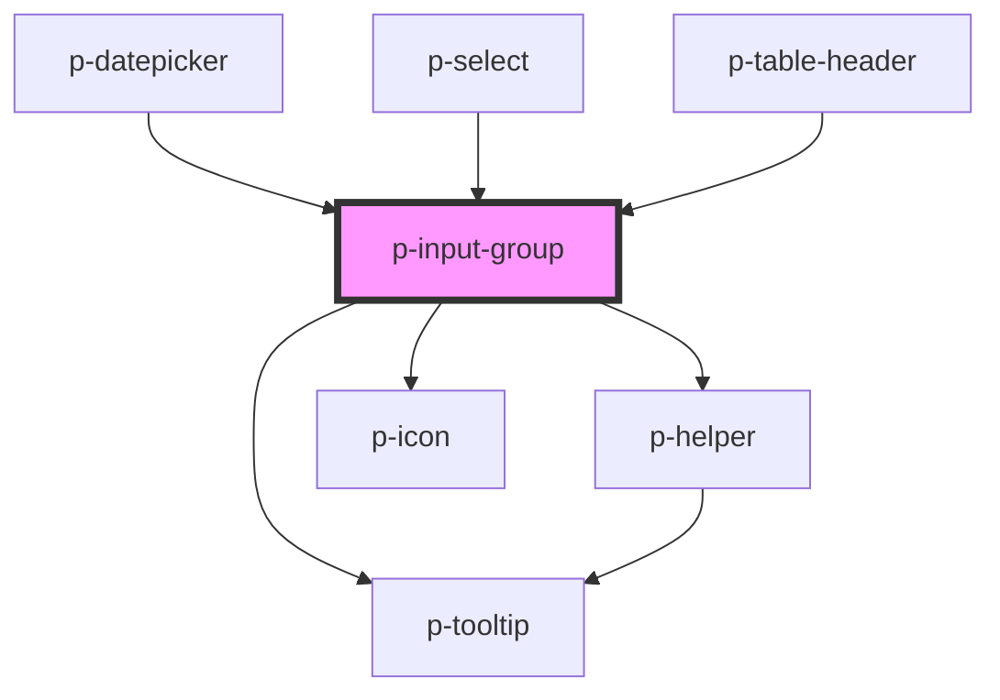

# p-input-group

<!-- Auto Generated Below -->

## Properties

| Property       | Attribute       | Description                        | Type                                                                                                                                                                                                                                                                                                                                                                                                                                                                                                                                                                                                                                                                          | Default     |
| -------------- | --------------- | ---------------------------------- | ----------------------------------------------------------------------------------------------------------------------------------------------------------------------------------------------------------------------------------------------------------------------------------------------------------------------------------------------------------------------------------------------------------------------------------------------------------------------------------------------------------------------------------------------------------------------------------------------------------------------------------------------------------------------------- | ----------- |
| `disabled`     | `disabled`      | Wether the input group is disabled | `boolean`                                                                                                                                                                                                                                                                                                                                                                                                                                                                                                                                                                                                                                                                     | `false`     |
| `error`        | `error`         | The helper of the input group      | `string`                                                                                                                                                                                                                                                                                                                                                                                                                                                                                                                                                                                                                                                                      | `undefined` |
| `focused`      | `focused`       | Wether the input group is focused  | `boolean`                                                                                                                                                                                                                                                                                                                                                                                                                                                                                                                                                                                                                                                                     | `false`     |
| `helper`       | `helper`        | The helper of the input group      | `string`                                                                                                                                                                                                                                                                                                                                                                                                                                                                                                                                                                                                                                                                      | `undefined` |
| `icon`         | `icon`          | Icon of the navigation item        | `"arrow" \| "attachment" \| "bread" \| "calendar" \| "camera" \| "car" \| "checklist" \| "checkmark" \| "chevron" \| "clock" \| "cogs" \| "comment" \| "document" \| "download" \| "envelope" \| "explanation" \| "eye" \| "filter" \| "folder" \| "grid" \| "headset" \| "integration" \| "list" \| "location" \| "megaphone" \| "menu" \| "minus" \| "more" \| "negative" \| "notification" \| "pagination" \| "payment" \| "pencil" \| "person" \| "plus" \| "question" \| "reload" \| "receipt" \| "report" \| "search" \| "settings" \| "sick" \| "signout" \| "switch" \| "tachometer" \| "task" \| "template" \| "tool" \| "trash" \| "turn" \| "upload" \| "warning"` | `undefined` |
| `iconFlip`     | `icon-flip`     | Icon flip                          | `"horizontal" \| "vertical"`                                                                                                                                                                                                                                                                                                                                                                                                                                                                                                                                                                                                                                                  | `undefined` |
| `iconPosition` | `icon-position` | Icon position                      | `"end" \| "start"`                                                                                                                                                                                                                                                                                                                                                                                                                                                                                                                                                                                                                                                            | `'start'`   |
| `iconRotate`   | `icon-rotate`   | Icon rotate                        | `-135 \| -180 \| -225 \| -25 \| -270 \| -315 \| -45 \| -90 \| 0 \| 135 \| 180 \| 225 \| 25 \| 270 \| 315 \| 45 \| 90`                                                                                                                                                                                                                                                                                                                                                                                                                                                                                                                                                         | `undefined` |
| `label`        | `label`         | The label of the input group       | `string`                                                                                                                                                                                                                                                                                                                                                                                                                                                                                                                                                                                                                                                                      | `undefined` |
| `prefix`       | `prefix`        | The prefix of the input group      | `string`                                                                                                                                                                                                                                                                                                                                                                                                                                                                                                                                                                                                                                                                      | `undefined` |
| `required`     | `required`      | Wether the field is required       | `boolean`                                                                                                                                                                                                                                                                                                                                                                                                                                                                                                                                                                                                                                                                     | `undefined` |
| `size`         | `size`          | The size of the input group        | `"medium" \| "small"`                                                                                                                                                                                                                                                                                                                                                                                                                                                                                                                                                                                                                                                         | `'medium'`  |
| `suffix`       | `suffix`        | The suffix of the input group      | `string`                                                                                                                                                                                                                                                                                                                                                                                                                                                                                                                                                                                                                                                                      | `undefined` |

## Dependencies

### Used by

 - [p-datepicker](../datepicker)
 - [p-select](../select)
 - [p-table-header](../table-header)

### Depends on

- [p-helper](../../atoms/helper)
- [p-icon](../../atoms/icon)
- [p-tooltip](../../atoms/tooltip)

### Graph

----------------------------------------------

*Built with [StencilJS](https://stenciljs.com/)*
