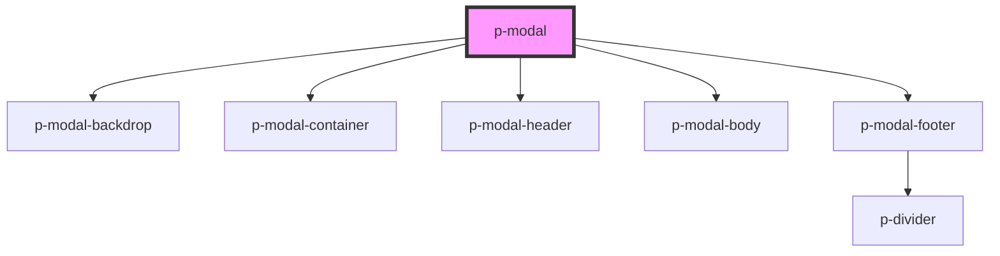

# Modal

## Usage:

```html
<p-modal title="Title">
    <div slot="body">Content</div>
    <div slot="footer">Footer</div>
</p-modal>
```

<!-- Auto Generated Below -->


## Properties

| Property  | Attribute | Description                     | Type                           | Default     |
| --------- | --------- | ------------------------------- | ------------------------------ | ----------- |
| `header`  | `header`  | The Header of the modal         | `string`                       | `undefined` |
| `show`    | `show`    | Wether to show the modal or not | `boolean`                      | `false`     |
| `size`    | `size`    | The size of the modal container | `"lg" \| "md" \| "sm" \| "xl"` | `'md'`      |
| `variant` | `variant` | The variant of the modal body   | `"default" \| "table"`         | `'default'` |


## Dependencies

### Depends on

- [p-modal-backdrop](../../atoms/modal-backdrop)
- [p-modal-container](../../atoms/modal-container)
- [p-modal-header](../../atoms/modal-header)
- [p-modal-body](../../atoms/modal-body)
- [p-modal-footer](../../atoms/modal-footer)

### Graph


----------------------------------------------

*Built with [StencilJS](https://stenciljs.com/)*
