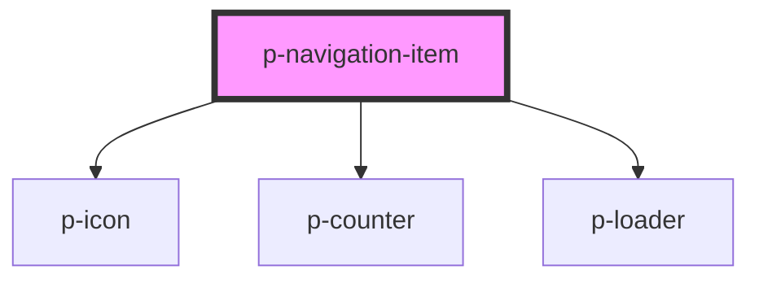

# p-navigation-item

<!-- Auto Generated Below -->

## Properties

| Property       | Attribute       | Description                          | Type                                                                                                                                                                                                                                                                                                                                                                                                                                                                                                                                                                                                                                                                                                                                                                                                                                                              | Default     |
| -------------- | --------------- | ------------------------------------ | ----------------------------------------------------------------------------------------------------------------------------------------------------------------------------------------------------------------------------------------------------------------------------------------------------------------------------------------------------------------------------------------------------------------------------------------------------------------------------------------------------------------------------------------------------------------------------------------------------------------------------------------------------------------------------------------------------------------------------------------------------------------------------------------------------------------------------------------------------------------- | ----------- |
| `active`       | `active`        | Wether the navigation item is active | `boolean`                                                                                                                                                                                                                                                                                                                                                                                                                                                                                                                                                                                                                                                                                                                                                                                                                                                         | `false`     |
| `counter`      | `counter`       | Icon of the navigation item          | `number \| string`                                                                                                                                                                                                                                                                                                                                                                                                                                                                                                                                                                                                                                                                                                                                                                                                                                                | `undefined` |
| `href`         | `href`          | The href of the navigation item      | `string`                                                                                                                                                                                                                                                                                                                                                                                                                                                                                                                                                                                                                                                                                                                                                                                                                                                          | `undefined` |
| `icon`         | `icon`          | Icon of the navigation item          | `"arrow" \| "attachment" \| "bread" \| "calendar" \| "camera" \| "car" \| "checklist" \| "checkmark" \| "chevron" \| "chevrons" \| "clock" \| "colleagues" \| "cogs" \| "comment" \| "companies" \| "company" \| "deactivate" \| "document" \| "download" \| "envelope" \| "explanation" \| "eye" \| "faPiggy" \| "filter" \| "folder" \| "formula" \| "grid" \| "hashtag" \| "headset" \| "hidden" \| "iDeal" \| "integration" \| "list" \| "location" \| "lock" \| "megaphone" \| "menu" \| "minus" \| "more" \| "negative" \| "notification" \| "pagination" \| "payment" \| "pencil" \| "person" \| "plan" \| "plus" \| "question" \| "reload" \| "receipt" \| "report" \| "review" \| "search" \| "settings" \| "sick" \| "signout" \| "switch" \| "tachometer" \| "task" \| "template" \| "tool" \| "trash" \| "turn" \| "unlock" \| "upload" \| "warning"` | `undefined` |
| `iconPosition` | `icon-position` | The icon position                    | `"end" \| "start"`                                                                                                                                                                                                                                                                                                                                                                                                                                                                                                                                                                                                                                                                                                                                                                                                                                                | `'start'`   |
| `loading`      | `loading`       | Loading                              | `boolean`                                                                                                                                                                                                                                                                                                                                                                                                                                                                                                                                                                                                                                                                                                                                                                                                                                                         | `false`     |
| `target`       | `target`        | The target of the navigation item    | `string`                                                                                                                                                                                                                                                                                                                                                                                                                                                                                                                                                                                                                                                                                                                                                                                                                                                          | `undefined` |

## Dependencies

### Depends on

- [p-icon](../../atoms/icon)
- [p-counter](../../atoms/counter)
- [p-loader](../../atoms/loader)

### Graph

----------------------------------------------

*Built with [StencilJS](https://stenciljs.com/)*
