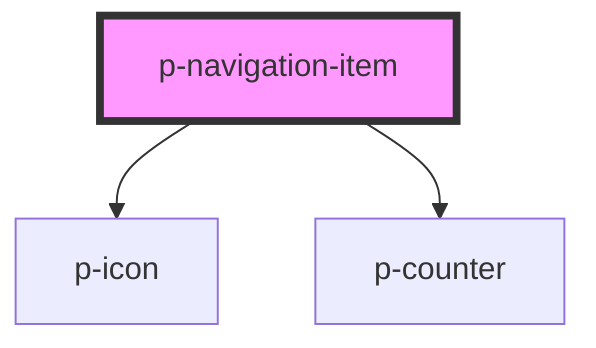

# NavigationItem

## Usage:

```html
<p-navigation-item>Text</p-navigation-item>
```

<!-- Auto Generated Below -->


## Properties

| Property  | Attribute | Description                          | Type                                                                                                                                                                                                                                                                                                                                                                                                                                                                                                               | Default     |
| --------- | --------- | ------------------------------------ | ------------------------------------------------------------------------------------------------------------------------------------------------------------------------------------------------------------------------------------------------------------------------------------------------------------------------------------------------------------------------------------------------------------------------------------------------------------------------------------------------------------------ | ----------- |
| `active`  | `active`  | Wether the navigation item is active | `boolean`                                                                                                                                                                                                                                                                                                                                                                                                                                                                                                          | `false`     |
| `counter` | `counter` | Icon of the navigation item          | `number \| string`                                                                                                                                                                                                                                                                                                                                                                                                                                                                                                 | `undefined` |
| `href`    | `href`    | The href of the navigation item      | `string`                                                                                                                                                                                                                                                                                                                                                                                                                                                                                                           | `undefined` |
| `icon`    | `icon`    | Icon of the navigation item          | `"arrow" \| "attachment" \| "bread" \| "calendar" \| "car" \| "checkmark" \| "chevron" \| "clock" \| "cogs" \| "comment" \| "document" \| "download" \| "envelope" \| "explanation" \| "eye" \| "filter" \| "grid" \| "headset" \| "list" \| "location" \| "megaphone" \| "minus" \| "negative" \| "pagination" \| "payment" \| "pencil" \| "person" \| "plus" \| "question" \| "receipt" \| "report" \| "search" \| "settings" \| "sick" \| "tachometer" \| "tool" \| "trash" \| "turn" \| "upload" \| "warning"` | `undefined` |
| `target`  | `target`  | The target of the navigation item    | `string`                                                                                                                                                                                                                                                                                                                                                                                                                                                                                                           | `undefined` |


## Dependencies

### Depends on

- [p-icon](../../atoms/icon)
- [p-counter](../../atoms/counter)

### Graph


----------------------------------------------

*Built with [StencilJS](https://stenciljs.com/)*
