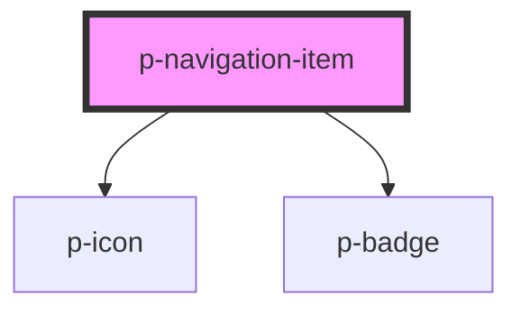

# p-navigation-item

<!-- Auto Generated Below -->

## Properties

| Property            | Attribute | Description                                | Type                                                                                                                                                                                                                                                                                                                                                                                                                                                                                                                                                                                                                                                                                                                                                                                                                                                              | Default     |
| ------------------- | --------- | ------------------------------------------ | ----------------------------------------------------------------------------------------------------------------------------------------------------------------------------------------------------------------------------------------------------------------------------------------------------------------------------------------------------------------------------------------------------------------------------------------------------------------------------------------------------------------------------------------------------------------------------------------------------------------------------------------------------------------------------------------------------------------------------------------------------------------------------------------------------------------------------------------------------------------- | ----------- |
| `active`            | `active`  | Wether the navigation item is active       | `boolean`                                                                                                                                                                                                                                                                                                                                                                                                                                                                                                                                                                                                                                                                                                                                                                                                                                                         | `false`     |
| `as`                | `as`      | The element to use for the navigation item | `string`                                                                                                                                                                                                                                                                                                                                                                                                                                                                                                                                                                                                                                                                                                                                                                                                                                                          | `'a'`       |
| `counter`           | `counter` | Icon of the navigation item                | `number \| string`                                                                                                                                                                                                                                                                                                                                                                                                                                                                                                                                                                                                                                                                                                                                                                                                                                                | `undefined` |
| `href`              | `href`    | The href of the navigation item            | `string`                                                                                                                                                                                                                                                                                                                                                                                                                                                                                                                                                                                                                                                                                                                                                                                                                                                          | `undefined` |
| `icon` _(required)_ | `icon`    | Icon of the navigation item                | `"arrow" \| "attachment" \| "bread" \| "calendar" \| "camera" \| "car" \| "checklist" \| "checkmark" \| "chevron" \| "chevrons" \| "clock" \| "colleagues" \| "cogs" \| "comment" \| "companies" \| "company" \| "deactivate" \| "document" \| "download" \| "envelope" \| "explanation" \| "eye" \| "faPiggy" \| "filter" \| "folder" \| "formula" \| "grid" \| "hashtag" \| "headset" \| "hidden" \| "iDeal" \| "integration" \| "list" \| "location" \| "lock" \| "megaphone" \| "menu" \| "minus" \| "more" \| "negative" \| "notification" \| "pagination" \| "payment" \| "pencil" \| "person" \| "plan" \| "plus" \| "question" \| "reload" \| "receipt" \| "report" \| "review" \| "search" \| "settings" \| "sick" \| "signout" \| "switch" \| "tachometer" \| "task" \| "template" \| "tool" \| "trash" \| "turn" \| "unlock" \| "upload" \| "warning"` | `undefined` |
| `target`            | `target`  | The target of the navigation item          | `string`                                                                                                                                                                                                                                                                                                                                                                                                                                                                                                                                                                                                                                                                                                                                                                                                                                                          | `undefined` |

## Dependencies

### Depends on

- [p-icon](../../atoms/icon)
- [p-badge](../../atoms/badge)

### Graph

----------------------------------------------

*Built with [StencilJS](https://stenciljs.com/)*
