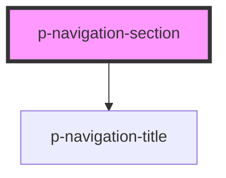

# Navigation section

## Usage:

```html
<p-navigation-section title="Title of the section">
	<p-navigation-item>Item 1</p-navigation-item>
	<p-navigation-item>Item 2</p-navigation-item>
	<p-navigation-item>Item 3</p-navigation-item>
</p-navigation-section>
```

<!-- Auto Generated Below -->


## Properties

| Property | Attribute | Description               | Type     | Default     |
| -------- | --------- | ------------------------- | -------- | ----------- |
| `header` | `header`  | The header of the section | `string` | `undefined` |


## Dependencies

### Depends on

- [p-navigation-title](../../atoms/navigation-title)

### Graph


----------------------------------------------

*Built with [StencilJS](https://stenciljs.com/)*
