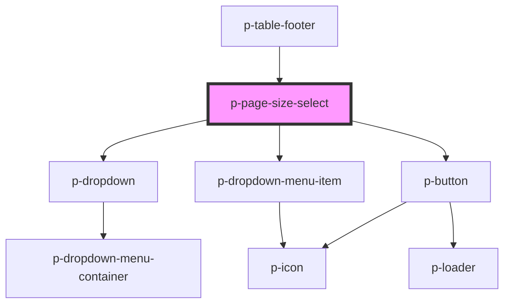

# p-page-size-select

<!-- Auto Generated Below -->

## Properties

| Property          | Attribute          | Description                                        | Type                        | Default                                                               |
| ----------------- | ------------------ | -------------------------------------------------- | --------------------------- | --------------------------------------------------------------------- |
| `buttonSize`      | `button-size`      | The size of the button                             | `"medium" \| "small"`       | `'small'`                                                             |
| `buttonTemplate`  | --                 | The template for the data view                     | `(value: number) => string` | `(size) =>         formatTranslation(this._locales.button, { size })` |
| `chevronPosition` | `chevron-position` | Chevron position                                   | `"end" \| "start"`          | `'start'`                                                             |
| `hidden`          | `hidden`           | Wether to hide when there is only 1 page available | `boolean`                   | `false`                                                               |
| `itemTemplate`    | --                 | The template for the data view                     | `(value: number) => string` | `(size) =>         formatTranslation(this._locales.item, { size })`   |
| `size`            | `size`             | The current page                                   | `number`                    | `defaultSize`                                                         |
| `sizeOptions`     | --                 | The available sizes                                | `number[]`                  | `defaultSizeOptions`                                                  |

## Events

| Event        | Description                     | Type                  |
| ------------ | ------------------------------- | --------------------- |
| `sizeChange` | Event whenever the size changes | `CustomEvent<number>` |

## Dependencies

### Used by

 - [p-table-footer](../table-footer)

### Depends on

- [p-dropdown](../dropdown)
- [p-button](../../atoms/button)
- [p-dropdown-menu-item](../../atoms/dropdown-menu-item)

### Graph

----------------------------------------------

*Built with [StencilJS](https://stenciljs.com/)*
