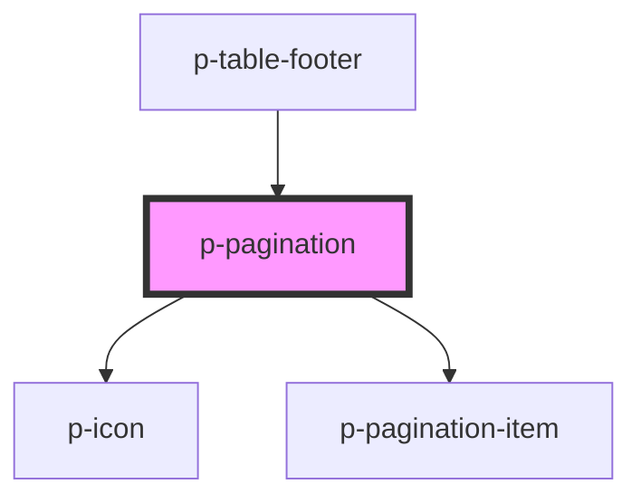

# Pagination

## Usage:

```html
<p-pagination total="{100}" />
```

<!-- Auto Generated Below -->


## Properties

| Property             | Attribute             | Description                                        | Type      | Default     |
| -------------------- | --------------------- | -------------------------------------------------- | --------- | ----------- |
| `hideOnSinglePage`   | `hide-on-single-page` | Wether to hide when there is only 1 page available | `boolean` | `false`     |
| `page`               | `page`                | The current page                                   | `number`  | `1`         |
| `pageSize`           | `page-size`           | The amount of items per page                       | `number`  | `12`        |
| `total` _(required)_ | `total`               | The total amount of items                          | `number`  | `undefined` |


## Events

| Event        | Description                     | Type                  |
| ------------ | ------------------------------- | --------------------- |
| `pageChange` | Event whenever the page changes | `CustomEvent<number>` |


## Dependencies

### Used by

 - [p-table-footer](../table-footer)

### Depends on

- [p-icon](../../atoms/icon)
- [p-pagination-item](../../atoms/pagination-item)

### Graph


----------------------------------------------

*Built with [StencilJS](https://stenciljs.com/)*
