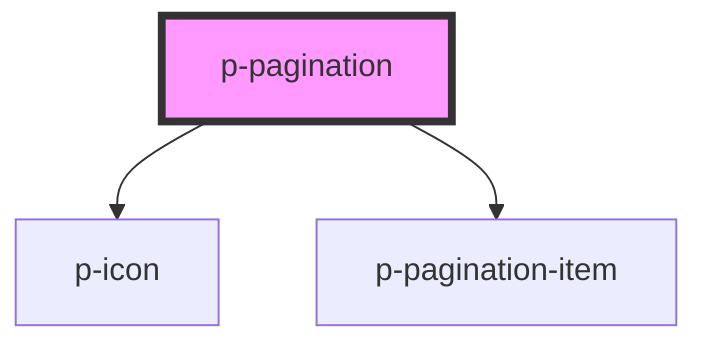

# Pagination

## Usage:

```html
<p-pagination total="{100}" />
```

<!-- Auto Generated Below -->


## Properties

| Property             | Attribute   | Description                  | Type     | Default     |
| -------------------- | ----------- | ---------------------------- | -------- | ----------- |
| `pageSize`           | `page-size` | The amount of items per page | `number` | `12`        |
| `total` _(required)_ | `total`     | The total amount of items    | `number` | `undefined` |
| `value`              | `value`     | The current page             | `number` | `1`         |


## Dependencies

### Depends on

- [p-icon](../../atoms/icon)
- [p-pagination-item](../../atoms/pagination-item)

### Graph


----------------------------------------------

*Built with [StencilJS](https://stenciljs.com/)*
