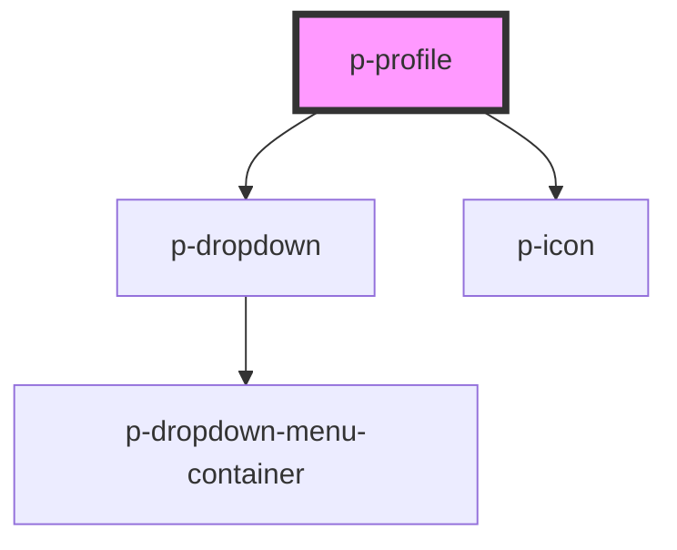

# Profile

## Usage:

```html
<p-profile>
    <p-avatar slot="avatar" />
    <span slot="title">John Doe</span>
    <span slot="subtitle">Software Engineer</span>
</p-profile>
```

<!-- Auto Generated Below -->


## Properties

| Property  | Attribute | Description                    | Type                             | Default   |
| --------- | --------- | ------------------------------ | -------------------------------- | --------- |
| `size`    | `size`    | The size of the profile avatar | `"large" \| "medium" \| "small"` | `'small'` |
| `variant` | `variant` | The variant of the profile     | `"company" \| "user"`            | `'user'`  |


## Dependencies

### Depends on

- [p-dropdown](../dropdown)
- [p-icon](../../atoms/icon)

### Graph


----------------------------------------------

*Built with [StencilJS](https://stenciljs.com/)*
