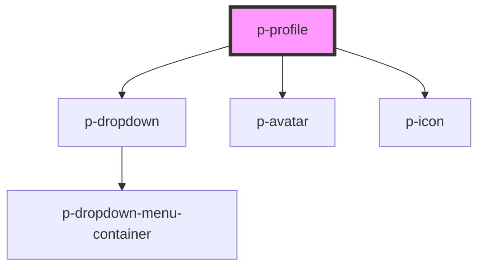

# Profile

## Usage:

```html
<p-profile>
    <p-avatar slot="avatar" />
    <span slot="title">John Doe</span>
    <span slot="subtitle">Software Engineer</span>
</p-profile>
```

<!-- Auto Generated Below -->


## Properties

| Property  | Attribute | Description                | Type                  | Default  |
| --------- | --------- | -------------------------- | --------------------- | -------- |
| `variant` | `variant` | The variant of the profile | `"company" \| "user"` | `'user'` |


## Dependencies

### Depends on

- [p-dropdown](../dropdown)
- [p-avatar](../../atoms/avatar)
- [p-icon](../../atoms/icon)

### Graph


----------------------------------------------

*Built with [StencilJS](https://stenciljs.com/)*
