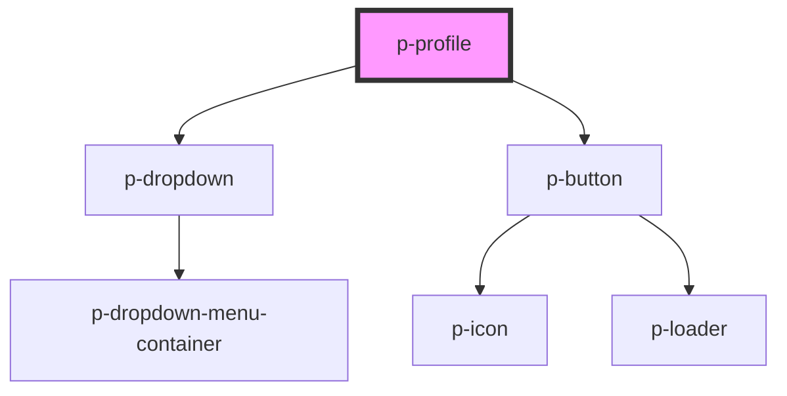

# Profile

## Usage:

```html
<p-profile>
    <p-avatar slot="avatar" />
    <span slot="title">John Doe</span>
    <span slot="subtitle">Software Engineer</span>
</p-profile>
```

<!-- Auto Generated Below -->


## Properties

| Property           | Attribute           | Description                  | Type                        | Default        |
| ------------------ | ------------------- | ---------------------------- | --------------------------- | -------------- |
| `dropdownLocation` | `dropdown-location` | The position of the dropdown | `"bottom-end" \| "top-end"` | `'bottom-end'` |


## Dependencies

### Depends on

- [p-dropdown](../dropdown)
- [p-button](../button)

### Graph


----------------------------------------------

*Built with [StencilJS](https://stenciljs.com/)*
