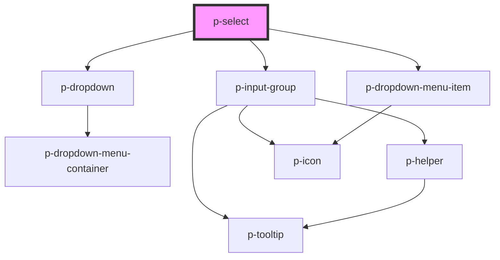

# Select

## Usage:

```html
<p-select>
    <!-- content -->
</p-select>
```

<!-- Auto Generated Below -->


## Properties

| Property                  | Attribute                  | Description                                       | Type              | Default     |
| ------------------------- | -------------------------- | ------------------------------------------------- | ----------------- | ----------- |
| `autoSelectFirst`         | `auto-select-first`        | Wether to automatically select the first item     | `boolean`         | `true`      |
| `autocompletePlaceholder` | `autocomplete-placeholder` | The placeholder of the input when auto completing | `string`          | `undefined` |
| `displayKey`              | `display-key`              | The key of the object to display                  | `string`          | `'text'`    |
| `enableAutocomplete`      | `enable-autocomplete`      | Wether to enable autocomplete                     | `boolean`         | `true`      |
| `items`                   | `items`                    | The items to show in the dropdown                 | `any[] \| string` | `undefined` |
| `placeholder`             | `placeholder`              | The placeholder of the input                      | `string`          | `undefined` |
| `query`                   | `query`                    | The current query                                 | `string`          | `undefined` |
| `queryKey`                | `query-key`                | The key of the object to display                  | `string`          | `undefined` |
| `value`                   | `value`                    | The current value                                 | `any`             | `undefined` |
| `valueKey`                | `value-key`                | The key of the object to return                   | `string`          | `'value'`   |


## Events

| Event         | Description                                      | Type                  |
| ------------- | ------------------------------------------------ | --------------------- |
| `queryChange` | Event when the query of the autocomplete changes | `CustomEvent<string>` |
| `valueChange` | Event when the value changes                     | `CustomEvent<any>`    |


## Dependencies

### Depends on

- [p-dropdown](../dropdown)
- [p-input-group](../input-group)
- [p-dropdown-menu-item](../../atoms/dropdown-menu-item)

### Graph


----------------------------------------------

*Built with [StencilJS](https://stenciljs.com/)*
