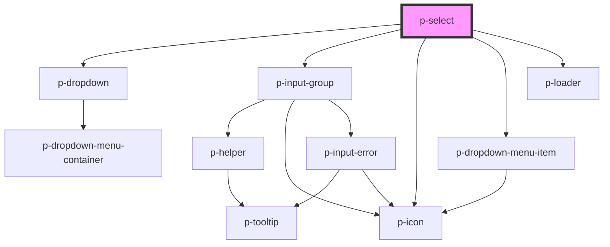

# Select

## Usage:

```html
<p-select>
    <!-- content -->
</p-select>
```

<!-- Auto Generated Below -->


## Properties

| Property                  | Attribute                  | Description                                           | Type                  | Default     |
| ------------------------- | -------------------------- | ----------------------------------------------------- | --------------------- | ----------- |
| `asyncFilter`             | `async-filter`             | Wether the input uses async filtering                 | `boolean`             | `false`     |
| `autoSelectFirst`         | `auto-select-first`        | Wether to automatically select the first item         | `boolean`             | `true`      |
| `autocompletePlaceholder` | `autocomplete-placeholder` | The placeholder of the input when auto completing     | `string`              | `undefined` |
| `disabled`                | `disabled`                 | Wether the input group is disabled used by the select | `boolean`             | `false`     |
| `displayKey`              | `display-key`              | The key of the object to display                      | `string`              | `'text'`    |
| `enableAutocomplete`      | `enable-autocomplete`      | Wether to enable autocomplete                         | `boolean`             | `true`      |
| `error`                   | `error`                    | The helper of the input group used by the select      | `string`              | `undefined` |
| `helper`                  | `helper`                   | The helper of the input group used by the select      | `string`              | `undefined` |
| `items`                   | `items`                    | The items to show in the dropdown                     | `any[] \| string`     | `undefined` |
| `label`                   | `label`                    | The label of the input group used by the select       | `string`              | `undefined` |
| `loading`                 | `loading`                  | Wether to show loading items                          | `boolean`             | `false`     |
| `maxDisplayedItems`       | `max-displayed-items`      | The maximum amount of items to display                | `number`              | `10`        |
| `placeholder`             | `placeholder`              | The placeholder of the input                          | `string`              | `undefined` |
| `prefix`                  | `prefix`                   | The prefix of the input group used by the select      | `string`              | `undefined` |
| `query`                   | `query`                    | The current query                                     | `string`              | `undefined` |
| `queryKey`                | `query-key`                | The key of the object to display                      | `string`              | `undefined` |
| `size`                    | `size`                     | The size of the input group used by the select        | `"medium" \| "small"` | `'medium'`  |
| `value`                   | `value`                    | The current value                                     | `any`                 | `undefined` |
| `valueKey`                | `value-key`                | The key of the object to return                       | `string`              | `'value'`   |


## Events

| Event         | Description                                      | Type                  |
| ------------- | ------------------------------------------------ | --------------------- |
| `queryChange` | Event when the query of the autocomplete changes | `CustomEvent<string>` |
| `valueChange` | Event when the value changes                     | `CustomEvent<any>`    |


## Dependencies

### Depends on

- [p-dropdown](../dropdown)
- [p-input-group](../input-group)
- [p-icon](../../atoms/icon)
- [p-dropdown-menu-item](../../atoms/dropdown-menu-item)
- [p-loader](../../atoms/loader)

### Graph


----------------------------------------------

*Built with [StencilJS](https://stenciljs.com/)*
