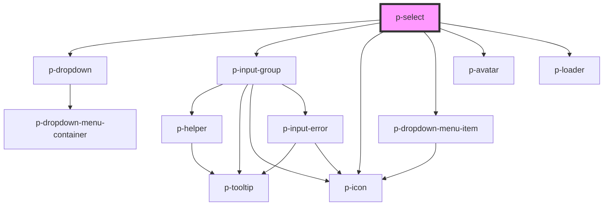

# p-select

<!-- Auto Generated Below -->

## Properties

| Property                  | Attribute                  | Description                                                                       | Type                                                                                                                                                                                                                                                                                                                                                                                                                                                                                                                                                                                                                                                                                                                                                                                                                | Default      |
| ------------------------- | -------------------------- | --------------------------------------------------------------------------------- | ------------------------------------------------------------------------------------------------------------------------------------------------------------------------------------------------------------------------------------------------------------------------------------------------------------------------------------------------------------------------------------------------------------------------------------------------------------------------------------------------------------------------------------------------------------------------------------------------------------------------------------------------------------------------------------------------------------------------------------------------------------------------------------------------------------------- | ------------ |
| `addItemText`             | `add-item-text`            | The text to show when add item is being shown                                     | `string`                                                                                                                                                                                                                                                                                                                                                                                                                                                                                                                                                                                                                                                                                                                                                                                                            | `'Add item'` |
| `asyncFilter`             | `async-filter`             | Wether the input uses async filtering                                             | `boolean`                                                                                                                                                                                                                                                                                                                                                                                                                                                                                                                                                                                                                                                                                                                                                                                                           | `false`      |
| `autoSelectFirst`         | `auto-select-first`        | Wether to automatically select the first item                                     | `boolean`                                                                                                                                                                                                                                                                                                                                                                                                                                                                                                                                                                                                                                                                                                                                                                                                           | `true`       |
| `autocompletePlaceholder` | `autocomplete-placeholder` | The placeholder of the input when auto completing                                 | `string`                                                                                                                                                                                                                                                                                                                                                                                                                                                                                                                                                                                                                                                                                                                                                                                                            | `undefined`  |
| `avatarKey`               | `avatar-key`               | The key of avatar within an item to show                                          | `string`                                                                                                                                                                                                                                                                                                                                                                                                                                                                                                                                                                                                                                                                                                                                                                                                            | `undefined`  |
| `avatarLettersKey`        | `avatar-letters-key`       | The key of avatar letters within an item to show when the avatar url doesn't work | `string`                                                                                                                                                                                                                                                                                                                                                                                                                                                                                                                                                                                                                                                                                                                                                                                                            | `undefined`  |
| `disabled`                | `disabled`                 | Wether the input group is disabled used by the select                             | `boolean`                                                                                                                                                                                                                                                                                                                                                                                                                                                                                                                                                                                                                                                                                                                                                                                                           | `false`      |
| `displayKey`              | `display-key`              | The key of the object to display                                                  | `string`                                                                                                                                                                                                                                                                                                                                                                                                                                                                                                                                                                                                                                                                                                                                                                                                            | `'text'`     |
| `enableAutocomplete`      | `enable-autocomplete`      | Wether to enable autocomplete                                                     | `boolean`                                                                                                                                                                                                                                                                                                                                                                                                                                                                                                                                                                                                                                                                                                                                                                                                           | `true`       |
| `error`                   | `error`                    | The helper of the input group used by the select                                  | `string`                                                                                                                                                                                                                                                                                                                                                                                                                                                                                                                                                                                                                                                                                                                                                                                                            | `undefined`  |
| `helper`                  | `helper`                   | The helper of the input group used by the select                                  | `string`                                                                                                                                                                                                                                                                                                                                                                                                                                                                                                                                                                                                                                                                                                                                                                                                            | `undefined`  |
| `icon`                    | `icon`                     | Icon of the select box                                                            | `"arrow" \| "attachment" \| "bread" \| "calendar" \| "camera" \| "car" \| "checklist" \| "checkmark" \| "chevron" \| "chevrons" \| "clock" \| "colleagues" \| "cogs" \| "comment" \| "companies" \| "company" \| "deactivate" \| "document" \| "download" \| "envelope" \| "explanation" \| "eye" \| "faPiggy" \| "filter" \| "folder" \| "formula" \| "grid" \| "hashtag" \| "headset" \| "iDeal" \| "integration" \| "list" \| "location" \| "megaphone" \| "menu" \| "minus" \| "more" \| "negative" \| "notification" \| "pagination" \| "payment" \| "pencil" \| "person" \| "plan" \| "plus" \| "question" \| "reload" \| "receipt" \| "report" \| "search" \| "settings" \| "sick" \| "signout" \| "switch" \| "tachometer" \| "task" \| "template" \| "tool" \| "trash" \| "turn" \| "upload" \| "warning"` | `undefined`  |
| `identifierKey`           | `identifier-key`           | The key to identify an object                                                     | `string`                                                                                                                                                                                                                                                                                                                                                                                                                                                                                                                                                                                                                                                                                                                                                                                                            | `undefined`  |
| `items`                   | `items`                    | The items to show in the dropdown                                                 | `any[] \| string`                                                                                                                                                                                                                                                                                                                                                                                                                                                                                                                                                                                                                                                                                                                                                                                                   | `undefined`  |
| `keepQuery`               | `keep-query`               | Wether to keep the query or not                                                   | `boolean`                                                                                                                                                                                                                                                                                                                                                                                                                                                                                                                                                                                                                                                                                                                                                                                                           | `true`       |
| `label`                   | `label`                    | The label of the input group used by the select                                   | `string`                                                                                                                                                                                                                                                                                                                                                                                                                                                                                                                                                                                                                                                                                                                                                                                                            | `undefined`  |
| `loading`                 | `loading`                  | Wether to show loading items                                                      | `boolean`                                                                                                                                                                                                                                                                                                                                                                                                                                                                                                                                                                                                                                                                                                                                                                                                           | `false`      |
| `maxDisplayedItems`       | `max-displayed-items`      | The maximum amount of items to display                                            | `number`                                                                                                                                                                                                                                                                                                                                                                                                                                                                                                                                                                                                                                                                                                                                                                                                            | `10`         |
| `multi`                   | `multi`                    | Wether to enable multi select                                                     | `boolean`                                                                                                                                                                                                                                                                                                                                                                                                                                                                                                                                                                                                                                                                                                                                                                                                           | `undefined`  |
| `placeholder`             | `placeholder`              | The placeholder of the input                                                      | `string`                                                                                                                                                                                                                                                                                                                                                                                                                                                                                                                                                                                                                                                                                                                                                                                                            | `undefined`  |
| `prefix`                  | `prefix`                   | The prefix of the input group used by the select                                  | `string`                                                                                                                                                                                                                                                                                                                                                                                                                                                                                                                                                                                                                                                                                                                                                                                                            | `undefined`  |
| `query`                   | `query`                    | The current query                                                                 | `string`                                                                                                                                                                                                                                                                                                                                                                                                                                                                                                                                                                                                                                                                                                                                                                                                            | `undefined`  |
| `queryKey`                | `query-key`                | The key of the object to display                                                  | `string`                                                                                                                                                                                                                                                                                                                                                                                                                                                                                                                                                                                                                                                                                                                                                                                                            | `undefined`  |
| `required`                | `required`                 | Wether the field is required                                                      | `boolean`                                                                                                                                                                                                                                                                                                                                                                                                                                                                                                                                                                                                                                                                                                                                                                                                           | `undefined`  |
| `showAddItem`             | `show-add-item`            | Wether to show a "add" item                                                       | `boolean`                                                                                                                                                                                                                                                                                                                                                                                                                                                                                                                                                                                                                                                                                                                                                                                                           | `false`      |
| `showChevron`             | `show-chevron`             | Wether to show the chevron or not                                                 | `boolean`                                                                                                                                                                                                                                                                                                                                                                                                                                                                                                                                                                                                                                                                                                                                                                                                           | `true`       |
| `size`                    | `size`                     | The size of the input group used by the select                                    | `"medium" \| "small"`                                                                                                                                                                                                                                                                                                                                                                                                                                                                                                                                                                                                                                                                                                                                                                                               | `'medium'`   |
| `value`                   | `value`                    | The current value                                                                 | `any`                                                                                                                                                                                                                                                                                                                                                                                                                                                                                                                                                                                                                                                                                                                                                                                                               | `undefined`  |
| `valueKey`                | `value-key`                | The key of the object to return                                                   | `string`                                                                                                                                                                                                                                                                                                                                                                                                                                                                                                                                                                                                                                                                                                                                                                                                            | `undefined`  |

## Events

| Event           | Description                                      | Type                  |
| --------------- | ------------------------------------------------ | --------------------- |
| `add`           | Event when the add item is clicked               | `CustomEvent<any>`    |
| `dropdownShown` | Event when the dropdown shows                    | `CustomEvent<any>`    |
| `queryChange`   | Event when the query of the autocomplete changes | `CustomEvent<string>` |
| `valueChange`   | Event when the value changes                     | `CustomEvent<any>`    |

## Dependencies

### Depends on

- [p-dropdown](../dropdown)
- [p-input-group](../input-group)
- [p-icon](../../atoms/icon)
- [p-dropdown-menu-item](../../atoms/dropdown-menu-item)
- [p-avatar](../../atoms/avatar)
- [p-loader](../../atoms/loader)

### Graph

----------------------------------------------

*Built with [StencilJS](https://stenciljs.com/)*
