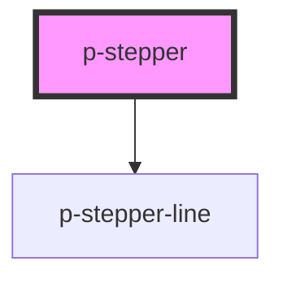

# Stepper

## Usage:

```html
<p-stepper>
    <p-stepper-item>Step 1</p-stepper-item>
    <p-stepper-item>Step 1</p-stepper-item>
    <p-stepper-item>Step 1</p-stepper-item>
</p-stepper>
```

<!-- Auto Generated Below -->


## Properties

| Property          | Attribute          | Description                                               | Type                         | Default        |
| ----------------- | ------------------ | --------------------------------------------------------- | ---------------------------- | -------------- |
| `activeStep`      | `active-step`      | The currently active step                                 | `number`                     | `1`            |
| `contentPosition` | `content-position` | The position of the content in case of vertical direction | `"end" \| "start"`           | `'end'`        |
| `direction`       | `direction`        | The direction of the stepper                              | `"horizontal" \| "vertical"` | `'horizontal'` |


## Dependencies

### Depends on

- [p-stepper-line](../../atoms/stepper-line)

### Graph


----------------------------------------------

*Built with [StencilJS](https://stenciljs.com/)*
