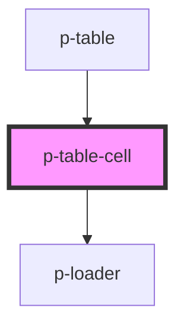

# Table Cell

## Usage:

```html
<p-table-cell>
    <!-- content -->
</p-table-cell>
```

<!-- Auto Generated Below -->


## Properties

| Property          | Attribute           | Description                        | Type                                              | Default                                         |
| ----------------- | ------------------- | ---------------------------------- | ------------------------------------------------- | ----------------------------------------------- |
| `checkbox`        | `checkbox`          | The checkbox to show               | `any`                                             | `undefined`                                     |
| `definition`      | --                  | The definition of the table column | `TableColumn`                                     | `undefined`                                     |
| `index`           | `index`             | The index of the column            | `number`                                          | `undefined`                                     |
| `item`            | `item`              | The item in question               | `any`                                             | `undefined`                                     |
| `rowIndex`        | `row-index`         | The index of the row               | `number`                                          | `undefined`                                     |
| `tableHasActions` | `table-has-actions` | Wether the table has actions       | `boolean`                                         | `false`                                         |
| `template`        | --                  | The template to show               | `(data: TableDefinitionData) => any`              | `({ 		value, 	}: TableDefinitionData) => value` |
| `value`           | `value`             | The value of the column            | `any`                                             | `undefined`                                     |
| `variant`         | `variant`           | The variant of the column          | `"actions" \| "default" \| "header" \| "loading"` | `'default'`                                     |


## Dependencies

### Used by

 - [p-table](../../organisms/table)

### Depends on

- [p-loader](../../atoms/loader)

### Graph


----------------------------------------------

*Built with [StencilJS](https://stenciljs.com/)*
