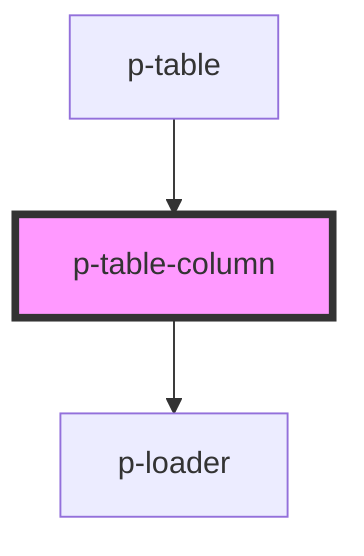

# Table Column

## Usage:

```html
<p-table-column>
    <!-- content -->
</p-table-column>
```

<!-- Auto Generated Below -->


## Properties

| Property     | Attribute   | Description                        | Type                                 | Default                                                  |
| ------------ | ----------- | ---------------------------------- | ------------------------------------ | -------------------------------------------------------- |
| `checkbox`   | `checkbox`  | The checkbox to show               | `any`                                | `undefined`                                              |
| `definition` | --          | The definition of the table column | `TableDefinition`                    | `undefined`                                              |
| `index`      | `index`     | The index of the column            | `number`                             | `undefined`                                              |
| `item`       | `item`      | The item in question               | `any`                                | `undefined`                                              |
| `rowIndex`   | `row-index` | The index of the row               | `number`                             | `undefined`                                              |
| `template`   | --          | The template to show               | `(data: TableDefinitionData) => any` | `({         value,     }: TableDefinitionData) => value` |
| `value`      | `value`     | The value of the column            | `any`                                | `undefined`                                              |
| `variant`    | `variant`   | The variant of the column          | `"default" \| "header" \| "loading"` | `'default'`                                              |


## Dependencies

### Used by

 - [p-table](../../organisms/table)

### Depends on

- [p-loader](../../atoms/loader)

### Graph


----------------------------------------------

*Built with [StencilJS](https://stenciljs.com/)*
