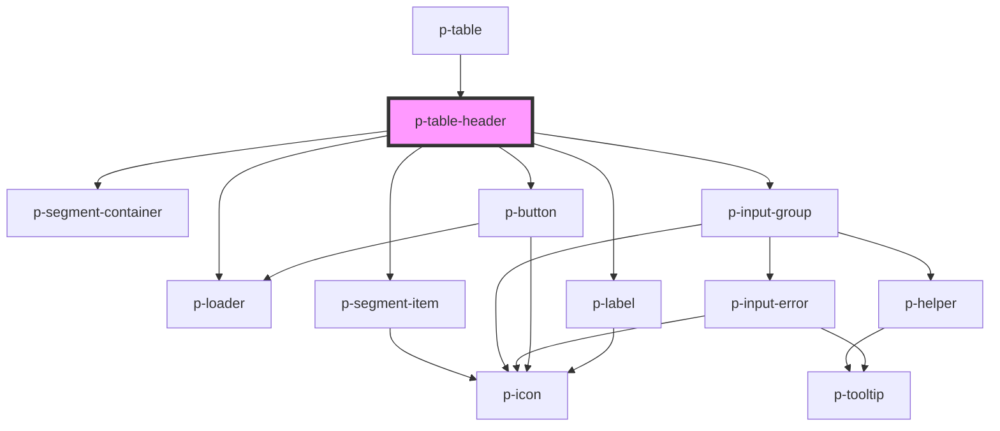

# Table Header

## Usage:

```html
<p-table-header>
    <!-- content -->
</p-table-header>
```

<!-- Auto Generated Below -->


## Properties

| Property                      | Attribute                        | Description                             | Type                         | Default                             |
| ----------------------------- | -------------------------------- | --------------------------------------- | ---------------------------- | ----------------------------------- |
| `activeQuickFilterIdentifier` | `active-quick-filter-identifier` | Active quick filter identifier          | `string`                     | `undefined`                         |
| `canEdit`                     | `can-edit`                       | Wether to enable the edit button        | `boolean`                    | `false`                             |
| `editButtonTemplate`          | --                               | The template for the edit button text   | `(amount: number) => string` | `this._defaultEditButtonTemplate`   |
| `enableEdit`                  | `enable-edit`                    | Wether to show the edit button          | `boolean`                    | `true`                              |
| `enableFilter`                | `enable-filter`                  | Wether to show the filter button        | `boolean`                    | `true`                              |
| `enableSearch`                | `enable-search`                  | Wether to show the search input         | `boolean`                    | `true`                              |
| `filterButtonTemplate`        | --                               | The template for the filter button text | `() => string`               | `this._defaultFilterButtonTemplate` |
| `itemsSelectedAmount`         | `items-selected-amount`          | The amount of items that are selected   | `number`                     | `0`                                 |
| `loading`                     | `loading`                        | Wether we want to show loading state    | `boolean`                    | `false`                             |
| `query`                       | `query`                          | The query to show in the search bar     | `string`                     | `undefined`                         |
| `quickFilters`                | --                               | Quick filters to show                   | `QuickFilter[]`              | `[]`                                |
| `selectedFiltersAmount`       | `selected-filters-amount`        | The amount of filters being selected    | `number`                     | `undefined`                         |


## Events

| Event         | Description                                    | Type                       |
| ------------- | ---------------------------------------------- | -------------------------- |
| `edit`        | Event when the edit button is clicked          | `CustomEvent<null>`        |
| `filter`      | Event when the filter button is clicked        | `CustomEvent<null>`        |
| `queryChange` | Event when the query changes                   | `CustomEvent<string>`      |
| `quickFilter` | Event when one of the quick filters is clicked | `CustomEvent<QuickFilter>` |


## Dependencies

### Used by

 - [p-table](../../organisms/table)

### Depends on

- [p-loader](../../atoms/loader)
- [p-segment-container](../../atoms/segment-container)
- [p-segment-item](../../atoms/segment-item)
- [p-input-group](../input-group)
- [p-button](../../atoms/button)
- [p-label](../../atoms/label)

### Graph


----------------------------------------------

*Built with [StencilJS](https://stenciljs.com/)*
