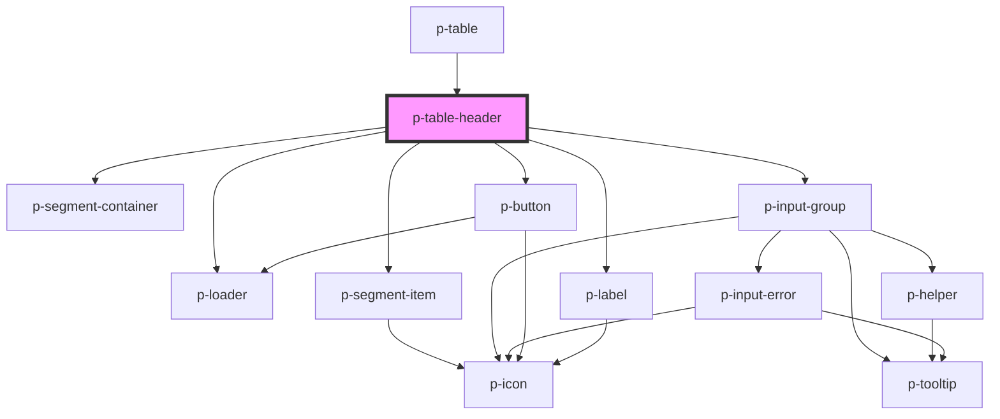

# p-table-header

<!-- Auto Generated Below -->

## Properties

| Property                      | Attribute                        | Description                                 | Type                                                                                                                                                                                                                                                                                                                                                                                                                                                                                                                                                                                                                                                                                                                                                                                                                                                              | Default                             |
| ----------------------------- | -------------------------------- | ------------------------------------------- | ----------------------------------------------------------------------------------------------------------------------------------------------------------------------------------------------------------------------------------------------------------------------------------------------------------------------------------------------------------------------------------------------------------------------------------------------------------------------------------------------------------------------------------------------------------------------------------------------------------------------------------------------------------------------------------------------------------------------------------------------------------------------------------------------------------------------------------------------------------------- | ----------------------------------- |
| `actionButtonTemplate`        | --                               | The template for the action button text     | `(amount: number) => string`                                                                                                                                                                                                                                                                                                                                                                                                                                                                                                                                                                                                                                                                                                                                                                                                                                      | `this._defaultActionButtonTemplate` |
| `actionIcon`                  | `action-icon`                    | The action button icon                      | `"arrow" \| "attachment" \| "bread" \| "calendar" \| "camera" \| "car" \| "checklist" \| "checkmark" \| "chevron" \| "chevrons" \| "clock" \| "colleagues" \| "cogs" \| "comment" \| "companies" \| "company" \| "deactivate" \| "document" \| "download" \| "envelope" \| "explanation" \| "eye" \| "faPiggy" \| "filter" \| "folder" \| "formula" \| "grid" \| "hashtag" \| "headset" \| "hidden" \| "iDeal" \| "integration" \| "list" \| "location" \| "lock" \| "megaphone" \| "menu" \| "minus" \| "more" \| "negative" \| "notification" \| "pagination" \| "payment" \| "pencil" \| "person" \| "plan" \| "plus" \| "question" \| "reload" \| "receipt" \| "report" \| "review" \| "search" \| "settings" \| "sick" \| "signout" \| "switch" \| "tachometer" \| "task" \| "template" \| "tool" \| "trash" \| "turn" \| "unlock" \| "upload" \| "warning"` | `'pencil'`                          |
| `actionLoading`               | `action-loading`                 | Wether the action button is loading         | `boolean`                                                                                                                                                                                                                                                                                                                                                                                                                                                                                                                                                                                                                                                                                                                                                                                                                                                         | `false`                             |
| `actionText`                  | `action-text`                    | The action button text if changed           | `string`                                                                                                                                                                                                                                                                                                                                                                                                                                                                                                                                                                                                                                                                                                                                                                                                                                                          | `undefined`                         |
| `activeQuickFilterIdentifier` | `active-quick-filter-identifier` | Active quick filter identifier              | `string`                                                                                                                                                                                                                                                                                                                                                                                                                                                                                                                                                                                                                                                                                                                                                                                                                                                          | `undefined`                         |
| `canUseAction`                | `can-use-action`                 | Wether to enable the action button          | `boolean`                                                                                                                                                                                                                                                                                                                                                                                                                                                                                                                                                                                                                                                                                                                                                                                                                                                         | `false`                             |
| `enableAction`                | `enable-action`                  | Wether to show the action button            | `boolean`                                                                                                                                                                                                                                                                                                                                                                                                                                                                                                                                                                                                                                                                                                                                                                                                                                                         | `true`                              |
| `enableFilter`                | `enable-filter`                  | Wether to show the filter button            | `boolean`                                                                                                                                                                                                                                                                                                                                                                                                                                                                                                                                                                                                                                                                                                                                                                                                                                                         | `true`                              |
| `enableFilterDesktop`         | `enable-filter-desktop`          | Wether to show the filter button on desktop | `boolean`                                                                                                                                                                                                                                                                                                                                                                                                                                                                                                                                                                                                                                                                                                                                                                                                                                                         | `true`                              |
| `enableSearch`                | `enable-search`                  | Wether to show the search input             | `boolean`                                                                                                                                                                                                                                                                                                                                                                                                                                                                                                                                                                                                                                                                                                                                                                                                                                                         | `true`                              |
| `filterButtonTemplate`        | --                               | The template for the filter button text     | `() => string`                                                                                                                                                                                                                                                                                                                                                                                                                                                                                                                                                                                                                                                                                                                                                                                                                                                    | `this._defaultFilterButtonTemplate` |
| `itemsSelectedAmount`         | `items-selected-amount`          | The amount of items that are selected       | `number`                                                                                                                                                                                                                                                                                                                                                                                                                                                                                                                                                                                                                                                                                                                                                                                                                                                          | `0`                                 |
| `loading`                     | `loading`                        | Wether we want to show loading state        | `boolean`                                                                                                                                                                                                                                                                                                                                                                                                                                                                                                                                                                                                                                                                                                                                                                                                                                                         | `false`                             |
| `query`                       | `query`                          | The query to show in the search bar         | `string`                                                                                                                                                                                                                                                                                                                                                                                                                                                                                                                                                                                                                                                                                                                                                                                                                                                          | `undefined`                         |
| `quickFilters`                | --                               | Quick filters to show                       | `QuickFilter[]`                                                                                                                                                                                                                                                                                                                                                                                                                                                                                                                                                                                                                                                                                                                                                                                                                                                   | `[]`                                |
| `selectedFiltersAmount`       | `selected-filters-amount`        | The amount of filters being selected        | `number`                                                                                                                                                                                                                                                                                                                                                                                                                                                                                                                                                                                                                                                                                                                                                                                                                                                          | `undefined`                         |

## Events

| Event         | Description                                    | Type                       |
| ------------- | ---------------------------------------------- | -------------------------- |
| `action`      | Event when the action button is clicked        | `CustomEvent<null>`        |
| `filter`      | Event when the filter button is clicked        | `CustomEvent<null>`        |
| `queryChange` | Event when the query changes                   | `CustomEvent<string>`      |
| `quickFilter` | Event when one of the quick filters is clicked | `CustomEvent<QuickFilter>` |

## Dependencies

### Used by

 - [p-table](../../organisms/table)

### Depends on

- [p-loader](../../atoms/loader)
- [p-segment-container](../../atoms/segment-container)
- [p-segment-item](../../atoms/segment-item)
- [p-input-group](../input-group)
- [p-button](../button)
- [p-label](../../atoms/label)

### Graph

----------------------------------------------

*Built with [StencilJS](https://stenciljs.com/)*
