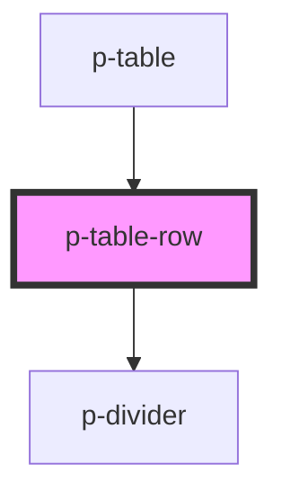

# Table Row

## Usage:

```html
<p-table-row>
    <!-- content -->
</p-table-row>
```

<!-- Auto Generated Below -->


## Properties

| Property      | Attribute      | Description           | Type                    | Default     |
| ------------- | -------------- | --------------------- | ----------------------- | ----------- |
| `enableHover` | `enable-hover` | Enable hover          | `boolean`               | `true`      |
| `variant`     | `variant`      | Variant of the header | `"default" \| "header"` | `'default'` |


## Dependencies

### Used by

 - [p-table](../../organisms/table)

### Depends on

- [p-divider](../../atoms/divider)

### Graph


----------------------------------------------

*Built with [StencilJS](https://stenciljs.com/)*
