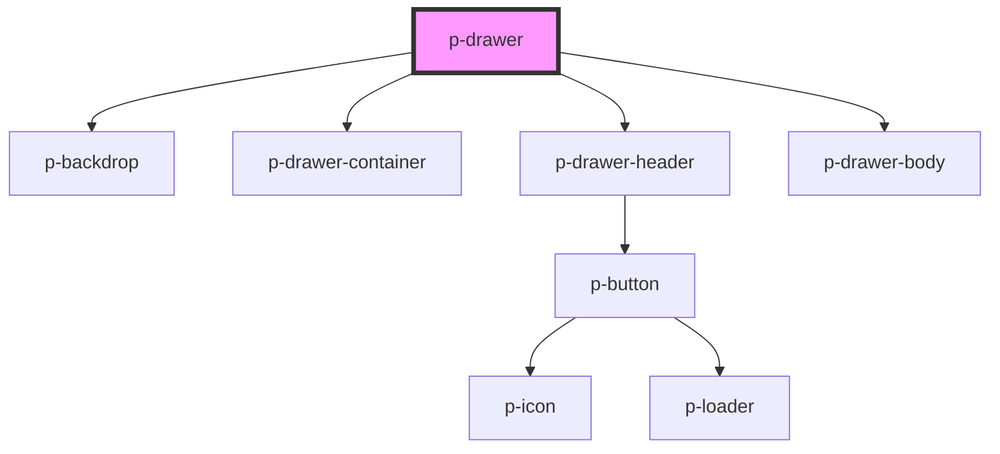

# Drawer

## Usage:

```html
<p-drawer header="Title">
    <div slot="body">Content</div>
</p-drawer>
```

<!-- Auto Generated Below -->


## Properties

| Property             | Attribute              | Description                                            | Type      | Default     |
| -------------------- | ---------------------- | ------------------------------------------------------ | --------- | ----------- |
| `applyBlur`          | `apply-blur`           | Wether to apply blur to the backdrop                   | `boolean` | `false`     |
| `backdropClickClose` | `backdrop-click-close` | Wether to hide the drawer when the backdrop is clicked | `boolean` | `true`      |
| `header`             | `header`               | The Header of the drawer                               | `string`  | `undefined` |
| `show`               | `show`                 | Wether to show the drawer or not                       | `boolean` | `false`     |
| `showClose`          | `show-close`           | Wether to show the close on mobile in the header       | `boolean` | `true`      |


## Events

| Event   | Description       | Type                      |
| ------- | ----------------- | ------------------------- |
| `close` | Close click event | `CustomEvent<MouseEvent>` |


## Dependencies

### Depends on

- [p-backdrop](../../atoms/backdrop)
- [p-drawer-container](../../atoms/drawer-container)
- [p-drawer-header](../../atoms/drawer-header)
- [p-drawer-body](../../atoms/drawer-body)

### Graph


----------------------------------------------

*Built with [StencilJS](https://stenciljs.com/)*
