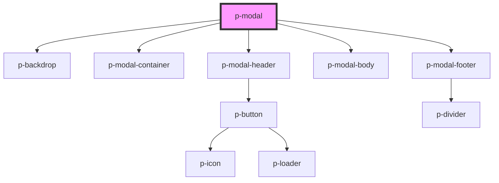

# Modal

## Usage:

```html
<p-modal header="Title">
    <div slot="body">Content</div>
    <div slot="footer">Footer</div>
</p-modal>
```

<!-- Auto Generated Below -->


## Properties

| Property             | Attribute              | Description                                           | Type                           | Default     |
| -------------------- | ---------------------- | ----------------------------------------------------- | ------------------------------ | ----------- |
| `applyBlur`          | `apply-blur`           | Wether to apply blur to the backdrop                  | `boolean`                      | `false`     |
| `backdropClickClose` | `backdrop-click-close` | Wether to hide the modal when the backdrop is clicked | `boolean`                      | `true`      |
| `header`             | `header`               | The Header of the modal                               | `string`                       | `undefined` |
| `show`               | `show`                 | Wether to show the modal or not                       | `boolean`                      | `false`     |
| `showMobileClose`    | `show-mobile-close`    | Wether to show the close on mobile in the header      | `boolean`                      | `true`      |
| `showMobileFooter`   | `show-mobile-footer`   | Wether to show the footer on mobile                   | `boolean`                      | `false`     |
| `size`               | `size`                 | The size of the modal container                       | `"lg" \| "md" \| "sm" \| "xl"` | `'md'`      |
| `variant`            | `variant`              | The variant of the modal body                         | `"default" \| "table"`         | `'default'` |


## Events

| Event          | Description       | Type                      |
| -------------- | ----------------- | ------------------------- |
| `closeClicked` | Close click event | `CustomEvent<MouseEvent>` |
| `closed`       | Closed event      | `CustomEvent<null>`       |


## Dependencies

### Depends on

- [p-backdrop](../../atoms/backdrop)
- [p-modal-container](../../atoms/modal-container)
- [p-modal-header](../../atoms/modal-header)
- [p-modal-body](../../atoms/modal-body)
- [p-modal-footer](../../atoms/modal-footer)

### Graph


----------------------------------------------

*Built with [StencilJS](https://stenciljs.com/)*
