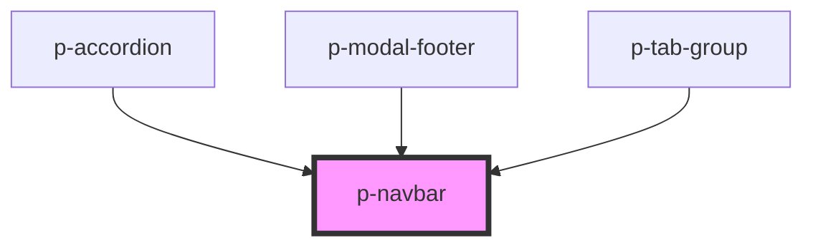

# Divider

## Usage:

```html
<p-navbar />

<!-- or -->

<p-navbar> Content </p-navbar>
```

<!-- Auto Generated Below -->

## Dependencies

### Used by

-   [p-accordion](../../molecules/accordion)
-   [p-modal-footer](../modal-footer)
-   [p-tab-group](../tab-group)

### Graph



---

_Built with [StencilJS](https://stenciljs.com/)_
