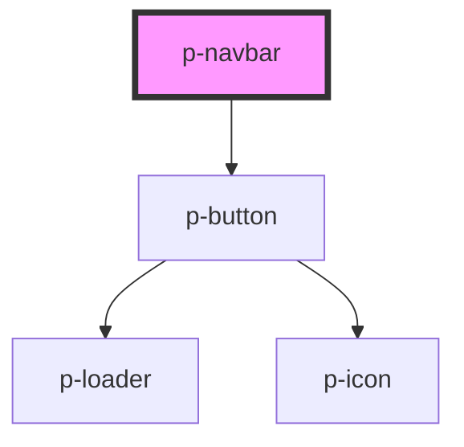

# Navbar

<!-- Auto Generated Below -->

## Properties

| Property    | Attribute    | Description                                             | Type     | Default   |
| ----------- | ------------ | ------------------------------------------------------- | -------- | --------- |
| `closeText` | `close-text` | The text to display for the close button                | `string` | `'Close'` |
| `menuText`  | `menu-text`  | The text to display for the menu button & sidebar title | `string` | `'Menu'`  |

## Dependencies

### Depends on

- [p-button](../../atoms/button)

### Graph

----------------------------------------------

*Built with [StencilJS](https://stenciljs.com/)*
