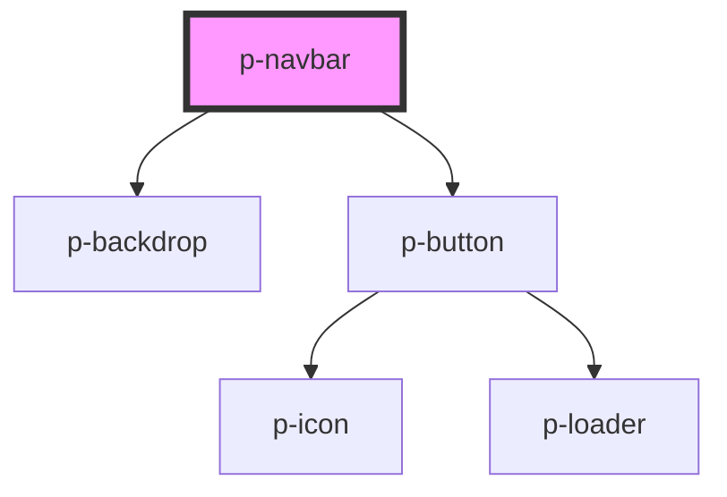

# Navbar

<!-- Auto Generated Below -->

## Properties

| Property   | Attribute   | Description                                             | Type     | Default  |
| ---------- | ----------- | ------------------------------------------------------- | -------- | -------- |
| `menuText` | `menu-text` | The text to display for the menu button & sidebar title | `string` | `'Menu'` |

## Dependencies

### Depends on

- [p-backdrop](../../atoms/backdrop)
- [p-button](../../atoms/button)

### Graph

----------------------------------------------

*Built with [StencilJS](https://stenciljs.com/)*
