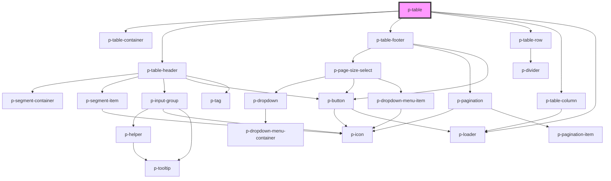

# Table

## Usage:

```html
<p-table>
    <p-table-definition />
</p-table>
```

<!-- Auto Generated Below -->


## Properties

| Property                      | Attribute                        | Description                                        | Type                        | Default              |
| ----------------------------- | -------------------------------- | -------------------------------------------------- | --------------------------- | -------------------- |
| `activeQuickFilterIdentifier` | `active-quick-filter-identifier` | Active quick filter identifier                     | `string`                    | `undefined`          |
| `amountOfLoadingRows`         | `amount-of-loading-rows`         | The amount of loading rows to show                 | `number`                    | `4`                  |
| `canSelectKey`                | `can-select-key`                 | A key to determine if a row can be selected        | `string`                    | `undefined`          |
| `editButtonTemplate`          | --                               | The template for the edit button text              | `(value: number) => string` | `undefined`          |
| `enableEdit`                  | `enable-edit`                    | Wether to show the edit button                     | `boolean`                   | `true`               |
| `enableExport`                | `enable-export`                  | Wether to enable export                            | `boolean`                   | `true`               |
| `enableFilter`                | `enable-filter`                  | Wether to show the filter button                   | `boolean`                   | `true`               |
| `enablePageSize`              | `enable-page-size`               | Wether to enable page size select                  | `boolean`                   | `true`               |
| `enablePagination`            | `enable-pagination`              | Wether to enable pagination                        | `boolean`                   | `true`               |
| `enableRowClick`              | `enable-row-click`               | Wether to enable row clicking                      | `boolean`                   | `true`               |
| `enableRowSelection`          | `enable-row-selection`           | Wether to enable selection                         | `boolean`                   | `true`               |
| `enableSearch`                | `enable-search`                  | Wether to show the search input                    | `boolean`                   | `true`               |
| `filterButtonTemplate`        | --                               | The template for the filter button text            | `(value: number) => string` | `undefined`          |
| `hideOnSinglePage`            | `hide-on-single-page`            | Wether to hide when there is only 1 page available | `boolean`                   | `true`               |
| `items`                       | `items`                          | The items to be fed to the table                   | `string`                    | `undefined`          |
| `loading`                     | `loading`                        | Wether data is loading                             | `boolean`                   | `false`              |
| `page`                        | `page`                           | The current page                                   | `number`                    | `1`                  |
| `pageSize`                    | `page-size`                      | The amount of items per page                       | `number`                    | `defaultSize`        |
| `pageSizeOptions`             | --                               | The options for the page size                      | `number[]`                  | `defaultSizeOptions` |
| `query`                       | `query`                          | The query to show in the search bar                | `string`                    | `undefined`          |
| `quickFilters`                | --                               | Quick filters to show                              | `QuickFilter[]`             | `[]`                 |
| `selectedFiltersAmount`       | `selected-filters-amount`        | The amount of filters being selected               | `number`                    | `undefined`          |
| `selectedRows`                | --                               | The current selection of items                     | `any[]`                     | `[]`                 |
| `selectionKey`                | `selection-key`                  | The key to determine if a row is selected          | `string`                    | `undefined`          |
| `total` _(required)_          | `total`                          | The total amount of items                          | `number`                    | `undefined`          |


## Events

| Event                | Description                                    | Type                         |
| -------------------- | ---------------------------------------------- | ---------------------------- |
| `edit`               | Event when the edit button is clicked          | `CustomEvent<null>`          |
| `export`             | Event whenever the page changes                | `CustomEvent<number>`        |
| `filter`             | Event when the filter button is clicked        | `CustomEvent<null>`          |
| `hasRendered`        | Event when the table has rendered              | `CustomEvent<number>`        |
| `pageChange`         | Event whenever the page changes                | `CustomEvent<number>`        |
| `pageSizeChange`     | Event whenever the page changes                | `CustomEvent<number>`        |
| `queryChange`        | Event when the query changes                   | `CustomEvent<string>`        |
| `quickFilter`        | Event when one of the quick filters is clicked | `CustomEvent<QuickFilter>`   |
| `rowClick`           | Event whenever a row is clicked                | `CustomEvent<RowClickEvent>` |
| `rowDeselected`      | Event whenever a row is deselected             | `CustomEvent<any>`           |
| `rowSelected`        | Event whenever a row is selected               | `CustomEvent<any>`           |
| `selectedRowsChange` | Event whenever the current selection changes   | `CustomEvent<any>`           |


## Dependencies

### Depends on

- [p-table-container](../../atoms/table-container)
- [p-table-header](../../molecules/table-header)
- [p-table-footer](../../molecules/table-footer)
- [p-table-row](../../molecules/table-row)
- [p-table-column](../../molecules/table-column)
- [p-loader](../../atoms/loader)

### Graph


----------------------------------------------

*Built with [StencilJS](https://stenciljs.com/)*
