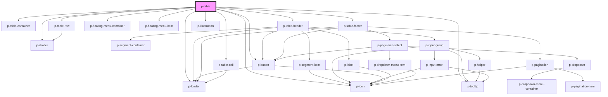

# p-table

<!-- Auto Generated Below -->

## Properties

| Property                             | Attribute                        | Description                                                | Type                                                                                                                                                                                                                                                                                                                                                                                                                                                                                                                                                                                                                                                                                                                                                                                                                                                              | Default                                                                                                                                                                                                               |
| ------------------------------------ | -------------------------------- | ---------------------------------------------------------- | ----------------------------------------------------------------------------------------------------------------------------------------------------------------------------------------------------------------------------------------------------------------------------------------------------------------------------------------------------------------------------------------------------------------------------------------------------------------------------------------------------------------------------------------------------------------------------------------------------------------------------------------------------------------------------------------------------------------------------------------------------------------------------------------------------------------------------------------------------------------- | --------------------------------------------------------------------------------------------------------------------------------------------------------------------------------------------------------------------- |
| `actionButtonEnabled`                | `action-button-enabled`          | Wether the action button is enabled                        | `boolean`                                                                                                                                                                                                                                                                                                                                                                                                                                                                                                                                                                                                                                                                                                                                                                                                                                                         | `false`                                                                                                                                                                                                               |
| `actionButtonIcon`                   | `action-button-icon`             | The action button icon                                     | `"arrow" \| "attachment" \| "bread" \| "calendar" \| "camera" \| "car" \| "checklist" \| "checkmark" \| "chevron" \| "chevrons" \| "clock" \| "colleagues" \| "cogs" \| "comment" \| "companies" \| "company" \| "deactivate" \| "document" \| "download" \| "envelope" \| "explanation" \| "eye" \| "faPiggy" \| "filter" \| "folder" \| "formula" \| "grid" \| "hashtag" \| "headset" \| "hidden" \| "iDeal" \| "integration" \| "list" \| "location" \| "lock" \| "megaphone" \| "menu" \| "minus" \| "more" \| "negative" \| "notification" \| "pagination" \| "payment" \| "pencil" \| "person" \| "plan" \| "plus" \| "question" \| "reload" \| "receipt" \| "report" \| "review" \| "search" \| "settings" \| "sick" \| "signout" \| "switch" \| "tachometer" \| "task" \| "template" \| "tool" \| "trash" \| "turn" \| "unlock" \| "upload" \| "warning"` | `'pencil'`                                                                                                                                                                                                            |
| `actionButtonLoading`                | `action-button-loading`          | Wether the action button is loading                        | `boolean`                                                                                                                                                                                                                                                                                                                                                                                                                                                                                                                                                                                                                                                                                                                                                                                                                                                         | `false`                                                                                                                                                                                                               |
| `actionButtonTemplate`               | --                               | The template for the action button text                    | `(amount: number) => string`                                                                                                                                                                                                                                                                                                                                                                                                                                                                                                                                                                                                                                                                                                                                                                                                                                      | `undefined`                                                                                                                                                                                                           |
| `actionButtonText`                   | `action-button-text`             | The action button text if changed                          | `string`                                                                                                                                                                                                                                                                                                                                                                                                                                                                                                                                                                                                                                                                                                                                                                                                                                                          | `undefined`                                                                                                                                                                                                           |
| `activeQuickFilterIdentifier`        | `active-quick-filter-identifier` | Active quick filter identifier                             | `string`                                                                                                                                                                                                                                                                                                                                                                                                                                                                                                                                                                                                                                                                                                                                                                                                                                                          | `undefined`                                                                                                                                                                                                           |
| `amountOfLoadingRows`                | `amount-of-loading-rows`         | The amount of loading rows to show                         | `number`                                                                                                                                                                                                                                                                                                                                                                                                                                                                                                                                                                                                                                                                                                                                                                                                                                                          | `6`                                                                                                                                                                                                                   |
| `canSelectKey`                       | `can-select-key`                 | A key to determine if a row can be selected                | `string`                                                                                                                                                                                                                                                                                                                                                                                                                                                                                                                                                                                                                                                                                                                                                                                                                                                          | `undefined`                                                                                                                                                                                                           |
| `emptyStateAction`                   | --                               |                                                            | `() => string`                                                                                                                                                                                                                                                                                                                                                                                                                                                                                                                                                                                                                                                                                                                                                                                                                                                    | `() => 		formatTranslation(this._locales.empty_state?.no_filter.action)`                                                                                                                                              |
| `emptyStateContent`                  | --                               |                                                            | `() => string`                                                                                                                                                                                                                                                                                                                                                                                                                                                                                                                                                                                                                                                                                                                                                                                                                                                    | `() => 		formatTranslation(this._locales.empty_state?.no_filter.content)`                                                                                                                                             |
| `emptyStateFilteredContent`          | --                               |                                                            | `() => string`                                                                                                                                                                                                                                                                                                                                                                                                                                                                                                                                                                                                                                                                                                                                                                                                                                                    | `() => 		formatTranslation(this._locales.empty_state.filtered.content)`                                                                                                                                               |
| `emptyStateFilteredHeader`           | --                               |                                                            | `() => string`                                                                                                                                                                                                                                                                                                                                                                                                                                                                                                                                                                                                                                                                                                                                                                                                                                                    | `() => 		formatTranslation(this._locales.empty_state.filtered.header)`                                                                                                                                                |
| `emptyStateHeader`                   | --                               |                                                            | `() => string`                                                                                                                                                                                                                                                                                                                                                                                                                                                                                                                                                                                                                                                                                                                                                                                                                                                    | `() => 		formatTranslation(this._locales.empty_state?.no_filter.header)`                                                                                                                                              |
| `enableAction`                       | `enable-action`                  | Wether to show the action button                           | `boolean`                                                                                                                                                                                                                                                                                                                                                                                                                                                                                                                                                                                                                                                                                                                                                                                                                                                         | `false`                                                                                                                                                                                                               |
| `enableEmptyStateAction`             | `enable-empty-state-action`      | Wether to enable empty state action                        | `boolean`                                                                                                                                                                                                                                                                                                                                                                                                                                                                                                                                                                                                                                                                                                                                                                                                                                                         | `true`                                                                                                                                                                                                                |
| `enableExport`                       | `enable-export`                  | Wether to enable export                                    | `boolean`                                                                                                                                                                                                                                                                                                                                                                                                                                                                                                                                                                                                                                                                                                                                                                                                                                                         | `true`                                                                                                                                                                                                                |
| `enableFilter`                       | `enable-filter`                  | Wether to show the filter button                           | `boolean`                                                                                                                                                                                                                                                                                                                                                                                                                                                                                                                                                                                                                                                                                                                                                                                                                                                         | `true`                                                                                                                                                                                                                |
| `enableFloatingMenu`                 | `enable-floating-menu`           | Wether to enable the floating menu                         | `boolean`                                                                                                                                                                                                                                                                                                                                                                                                                                                                                                                                                                                                                                                                                                                                                                                                                                                         | `true`                                                                                                                                                                                                                |
| `enableFooter`                       | `enable-footer`                  | Wether to show the header                                  | `boolean`                                                                                                                                                                                                                                                                                                                                                                                                                                                                                                                                                                                                                                                                                                                                                                                                                                                         | `true`                                                                                                                                                                                                                |
| `enableHeader`                       | `enable-header`                  | Wether to show the header                                  | `boolean`                                                                                                                                                                                                                                                                                                                                                                                                                                                                                                                                                                                                                                                                                                                                                                                                                                                         | `true`                                                                                                                                                                                                                |
| `enablePageSize`                     | `enable-page-size`               | Wether to enable page size select                          | `boolean`                                                                                                                                                                                                                                                                                                                                                                                                                                                                                                                                                                                                                                                                                                                                                                                                                                                         | `true`                                                                                                                                                                                                                |
| `enablePagination`                   | `enable-pagination`              | Wether to enable pagination                                | `boolean`                                                                                                                                                                                                                                                                                                                                                                                                                                                                                                                                                                                                                                                                                                                                                                                                                                                         | `true`                                                                                                                                                                                                                |
| `enableRowClick`                     | `enable-row-click`               | Wether to enable row clicking                              | `boolean`                                                                                                                                                                                                                                                                                                                                                                                                                                                                                                                                                                                                                                                                                                                                                                                                                                                         | `true`                                                                                                                                                                                                                |
| `enableRowSelection`                 | `enable-row-selection`           | Wether to enable selection                                 | `boolean`                                                                                                                                                                                                                                                                                                                                                                                                                                                                                                                                                                                                                                                                                                                                                                                                                                                         | `true`                                                                                                                                                                                                                |
| `enableSearch`                       | `enable-search`                  | Wether to show the search input                            | `boolean`                                                                                                                                                                                                                                                                                                                                                                                                                                                                                                                                                                                                                                                                                                                                                                                                                                                         | `true`                                                                                                                                                                                                                |
| `filterButtonTemplate`               | --                               | The template for the filter button text                    | `() => string`                                                                                                                                                                                                                                                                                                                                                                                                                                                                                                                                                                                                                                                                                                                                                                                                                                                    | `undefined`                                                                                                                                                                                                           |
| `floatingMenuAmountSelectedTemplate` | --                               | The template for amount selected item in the floating menu | `(amount: number) => string`                                                                                                                                                                                                                                                                                                                                                                                                                                                                                                                                                                                                                                                                                                                                                                                                                                      | `( 		amount: number 	) => 		formatTranslation( 			(amount === 1 				? this._locales.floating_menu?.amount_selected 				: this._locales.floating_menu?.amount_selected_plural 			)?.replace('{{amount}}', amount) 		)` |
| `footerLoading`                      | `footer-loading`                 | Wether the footer should show loading state                | `boolean`                                                                                                                                                                                                                                                                                                                                                                                                                                                                                                                                                                                                                                                                                                                                                                                                                                                         | `false`                                                                                                                                                                                                               |
| `headerLoading`                      | `header-loading`                 | Wether the header should show loading state                | `boolean`                                                                                                                                                                                                                                                                                                                                                                                                                                                                                                                                                                                                                                                                                                                                                                                                                                                         | `false`                                                                                                                                                                                                               |
| `hideOnSinglePage`                   | `hide-on-single-page`            | Wether to hide when there is only 1 page available         | `boolean`                                                                                                                                                                                                                                                                                                                                                                                                                                                                                                                                                                                                                                                                                                                                                                                                                                                         | `true`                                                                                                                                                                                                                |
| `items`                              | `items`                          | The items to be fed to the table                           | `string`                                                                                                                                                                                                                                                                                                                                                                                                                                                                                                                                                                                                                                                                                                                                                                                                                                                          | `undefined`                                                                                                                                                                                                           |
| `loading`                            | `loading`                        | Wether data is loading                                     | `boolean`                                                                                                                                                                                                                                                                                                                                                                                                                                                                                                                                                                                                                                                                                                                                                                                                                                                         | `false`                                                                                                                                                                                                               |
| `page`                               | `page`                           | The current page                                           | `number`                                                                                                                                                                                                                                                                                                                                                                                                                                                                                                                                                                                                                                                                                                                                                                                                                                                          | `1`                                                                                                                                                                                                                   |
| `pageSize`                           | `page-size`                      | The amount of items per page                               | `number`                                                                                                                                                                                                                                                                                                                                                                                                                                                                                                                                                                                                                                                                                                                                                                                                                                                          | `defaultSize`                                                                                                                                                                                                         |
| `pageSizeOptions`                    | --                               | The options for the page size                              | `number[]`                                                                                                                                                                                                                                                                                                                                                                                                                                                                                                                                                                                                                                                                                                                                                                                                                                                        | `defaultSizeOptions`                                                                                                                                                                                                  |
| `query`                              | `query`                          | The query to show in the search bar                        | `string`                                                                                                                                                                                                                                                                                                                                                                                                                                                                                                                                                                                                                                                                                                                                                                                                                                                          | `undefined`                                                                                                                                                                                                           |
| `quickFilters`                       | --                               | Quick filters to show                                      | `QuickFilter[]`                                                                                                                                                                                                                                                                                                                                                                                                                                                                                                                                                                                                                                                                                                                                                                                                                                                   | `[]`                                                                                                                                                                                                                  |
| `rowSelectionLimit`                  | `row-selection-limit`            | A limit to the amount of rows that can be selected         | `number`                                                                                                                                                                                                                                                                                                                                                                                                                                                                                                                                                                                                                                                                                                                                                                                                                                                          | `undefined`                                                                                                                                                                                                           |
| `selectedFiltersAmount`              | `selected-filters-amount`        | The amount of filters being selected                       | `number`                                                                                                                                                                                                                                                                                                                                                                                                                                                                                                                                                                                                                                                                                                                                                                                                                                                          | `undefined`                                                                                                                                                                                                           |
| `selectedRows`                       | --                               | The current selection of items                             | `any[]`                                                                                                                                                                                                                                                                                                                                                                                                                                                                                                                                                                                                                                                                                                                                                                                                                                                           | `[]`                                                                                                                                                                                                                  |
| `selectionKey`                       | `selection-key`                  | The key to determine if a row is selected                  | `string`                                                                                                                                                                                                                                                                                                                                                                                                                                                                                                                                                                                                                                                                                                                                                                                                                                                          | `undefined`                                                                                                                                                                                                           |
| `shadow`                             | `shadow`                         |                                                            | `boolean`                                                                                                                                                                                                                                                                                                                                                                                                                                                                                                                                                                                                                                                                                                                                                                                                                                                         | `true`                                                                                                                                                                                                                |
| `total` _(required)_                 | `total`                          | The total amount of items                                  | `number`                                                                                                                                                                                                                                                                                                                                                                                                                                                                                                                                                                                                                                                                                                                                                                                                                                                          | `undefined`                                                                                                                                                                                                           |

## Events

| Event                   | Description                                    | Type                         |
| ----------------------- | ---------------------------------------------- | ---------------------------- |
| `action`                | Event when the action button is clicked        | `CustomEvent<null>`          |
| `emptyStateActionClick` | Event whenever the empty state is clicked      | `CustomEvent<null>`          |
| `export`                | Event whenever the page changes                | `CustomEvent<number>`        |
| `filter`                | Event when the filter button is clicked        | `CustomEvent<null>`          |
| `hasRendered`           | Event when the table has rendered              | `CustomEvent<number>`        |
| `pageChange`            | Event whenever the page changes                | `CustomEvent<number>`        |
| `pageSizeChange`        | Event whenever the page changes                | `CustomEvent<number>`        |
| `queryChange`           | Event when the query changes                   | `CustomEvent<string>`        |
| `quickFilter`           | Event when one of the quick filters is clicked | `CustomEvent<QuickFilter>`   |
| `rowClick`              | Event whenever a row is clicked                | `CustomEvent<RowClickEvent>` |
| `rowDeselected`         | Event whenever a row is deselected             | `CustomEvent<any>`           |
| `rowSelected`           | Event whenever a row is selected               | `CustomEvent<any>`           |
| `selectedRowsChange`    | Event whenever the current selection changes   | `CustomEvent<any>`           |

## Dependencies

### Depends on

- [p-table-container](../../atoms/table-container)
- [p-table-header](../../molecules/table-header)
- [p-table-footer](../../molecules/table-footer)
- [p-floating-menu-container](../../atoms/floating-menu-container)
- [p-floating-menu-item](../../atoms/floating-menu-item)
- [p-divider](../../atoms/divider)
- [p-loader](../../atoms/loader)
- [p-icon](../../atoms/icon)
- [p-table-row](../../molecules/table-row)
- [p-table-cell](../../molecules/table-cell)
- [p-tooltip](../../atoms/tooltip)
- [p-button](../../atoms/button)
- [p-illustration](../../atoms/illustration)

### Graph

----------------------------------------------

*Built with [StencilJS](https://stenciljs.com/)*
